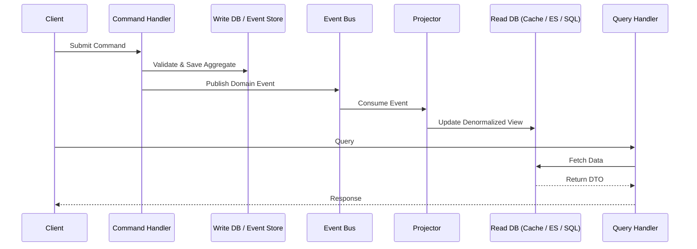

# Command Query Responsibility Segregation (CQRS)

## Überblick

Command Query Responsibility Segregation (CQRS) ist ein Architekturmuster, das Bertrand Meyers **Command-Query Separation (CQS)**-Prinzip von der Methodenebene auf die Dienst- und Systemebene hebt. Anstatt dass ein einziges Modell sowohl Lese- als auch Schreiboperationen verarbeitet, teilt CQRS das System explizit in zwei getrennte Seiten auf:

- **Befehle (Schreibseite):** Verarbeitet zustandsändernde Operationen. Befehle drücken eine imperative Absicht aus (z. B. `PlaceOrder`, `CancelBooking`). Sie sollten keine Daten zurückgeben; sie geben Erfolg/Fehlschlag zurück.
- **Abfragen (Lesseite):** Verarbeitet Datenabrufe. Abfragen sind nebenwirkungsfreie Anfragen (z. B. `GetOrderSummary`). Sie verändern niemals den Zustand.

> *"CQRS steht für Command Query Responsibility Segregation. Es ist ein Muster, das ich zum ersten Mal von Greg Young beschrieben hörte. Im Kern geht es um die Idee, dass Sie ein anderes Modell zum Aktualisieren von Informationen verwenden können als das Modell, mit dem Sie Informationen lesen."* — **Martin Fowler**

Diese Trennung ermöglicht es, jede Seite unabhängig zu optimieren, zu skalieren und weiterzuentwickeln, was sie zu einem Eckpfeiler von Domain-Driven Design (DDD) und Event-Driven Architecture (EDA) macht.

---

## Warum CQRS?

Traditionelle CRUD-Architekturen zwingen ein einzelnes Modell dazu, doppelte Zwecke zu erfüllen. Dies erzeugt eine Reihe wiederkehrender Probleme:

| Problem | Einzelnes Modell (CRUD) | CQRS-Lösung |
|---|---|---|
| **Komplexität** | Das Domänenmodell wird mit abfragespezifischer Logik (DTOs, Projektionen, Caching) verunreinigt. | Das Schreibmodell bleibt rein; das Lesemodell ist einfacher Datenabruf. |
| **Leistung** | Ein Datenbankschema muss sowohl normalisierte Schreibvorgänge als auch denormalisierte Berichte bedienen. | Jede Seite kann die beste Speicher-Engine verwenden (normalisiertes RDBMS für Schreibvorgänge, Elasticsearch/Redis für Lesevorgänge). |
| **Skalierbarkeit** | Lese- und Schreibvorgänge müssen gemeinsam skaliert werden. | Lese- und Schreibmodelle können unabhängig skaliert werden (z. B. 10 Replikate für Lesevorgänge, 1 Primärserver für Schreibvorgänge). |
| **Sicherheit** | Lese-/Schreibberechtigungen sind in komplexer rollenbasierter Logik verknäuelt. | Klare Grenzen: Befehle erfordern Schreibberechtigungen, Abfragen erfordern Leseberechtigungen. |
| **Konflikte** | Schreibsperren blockieren Lesevorgänge; komplexe Abfragen blockieren Schreibvorgänge. | Keine Konflikte: Das Schreibmodell committet sofort; Lesevorgänge treffen auf einen völlig getrennten Speicher. |
| **Teamautonomie** | Ein Modell zwingt ein einziges Team, die gesamte Datenschicht zu besitzen. | Verschiedene Teams können das Befehlsmodell und das Abfragemodell besitzen. |

---

## Kernkonzepte

### Befehle
- Repräsentieren **Absicht**.
- Werden imperativ oder in der Vergangenheitsform benannt (`PlaceOrder`, `MarkInvoiceAsPaid`).
- **Geben keine Daten zurück** (nur Bestätigung oder Fehler).
- Werden **vor** der Verarbeitung gegen Geschäftsregeln validiert.
- Werden typischerweise in einer Command Bus oder Nachrichtenwarteschlange eingereiht.

### Abfragen
- Repräsentieren eine **Anforderung nach Daten**.
- Werden deklarativ benannt (`GetOrderSummary`, `FindAvailableProducts`).
- **Sollten keine Nebenwirkungen haben**.
- Geben **DTOs** oder schreibgeschützte View-Modelle zurück.
- Werden gegen einen hochoptimierten Lesespeicher ausgeführt.

### Befehlmodell (Schreibseite)
- Erzwingt geschäftliche Invarianten.
- Verwendet oft Aggregates (DDD), um Konsistenz sicherzustellen.
- Veröffentlicht Domain Events nach Zustandsänderungen.
- Speicher: typischerweise ein Event Store (Event Sourcing) oder eine normalisierte relationale Datenbank.

### Abfragemodell (Lesseite)
- Gibt ausschließlich Daten zurück.
- Verwendet denormalisierte Tabellen, materialisierte Ansichten oder spezialisierte Suchindizes.
- Wird **asynchron** über Ereignisprojektionen aktualisiert.
- Kann vollständig aus dem Ereignisstrom neu aufgebaut werden.

### Projektionen & Eventuelle Konsistenz
Der Klebstoff zwischen den beiden Seiten ist der **Ereignisprojektor** (oder Abonnent). Wenn ein Befehl ein Domain Event veröffentlicht (z. B. `OrderPlacedEvent`), aktualisiert ein Ereignis-Handler das Lesemodell.



---

## Hauptmerkmale

### 1. Getrennte Modelle
Das Schreibmodell konzentriert sich auf **Konsistenz und Verhalten**. Das Lesemodell konzentriert sich auf **Leistung und Form**. Sie können in verschiedenen Datenbanken, verschiedenen Schemata oder verschiedenen Programmiersprachen sein.

### 2. Aufgabenbasierte Befehle
Befehle werden in der **ubiquitären Sprache** der Domäne ausgedrückt, nicht als generische CRUD-Verben. Dies verbessert die Kommunikation zwischen Domänenexperten und Entwicklern.
- **Schlecht:** `UpdateOrderStatus(someBool)`
- **Gut:** `ApproveOrder`, `FlagForFraudReview`, `ShipOrder`

### 3. Eventuelle Konsistenz
Die Leseseite wird in der Regel asynchron aktualisiert. Dies bedeutet, dass das Lesemodell dem Schreibmodell leicht hinterherhinken kann. Dies ist ein bewusster Kompromiss. Hochtransaktionale Systeme (Bankkontobücher) erfordern möglicherweise eine sorgfältige Handhabung, aber die meisten Systeme tolerieren subsekundäre eventuelle Konsistenz.

### 4. Unabhängige Skalierung
- **Schreibmodell:** Vertikal skalieren für Transaktionsdurchsatz oder horizontal skalieren durch Sharding nach Aggregate.
- **Lesemodell:** Horizontal skalieren mit Lesereplikaten, Caching-Schichten (Redis) oder Suchmaschinen (Elasticsearch).

### 5. Event-Sourcing-Kompatibilität
CQRS paart sich natürlich mit Event Sourcing (ES). In dieser Kombination:
- Befehle erzeugen **Ereignisse**.
- Der Schreibspeicher ist ein **Event Store** (Nur-Anhängen-Protokoll).
- Die Lesemodelle sind **Projektionen**, die aus dem Ereignisstrom erstellt werden.
- Vollständige Audit-Trail und zeitliche Abfragen werden trivial.

### 6. Erweiterte Testbarkeit
Das Schreibmodell kann isoliert getestet werden (reine Domänenlogik). Das Lesemodell kann gegen einen bekannten Zustand getestet werden. Integrationstests validieren, dass Ereignisse korrekt projiziert werden.

---

## Wann verwenden / Wann vermeiden

### CQRS verwenden, wenn:
- Ihre Domäne komplex ist und dasselbe Modell erhebliche Reibung bei der Entwicklung erzeugt.
- Die **Leseauslastung** sich drastisch von der **Schreibauslastung** unterscheidet (z. B. operative Schreibvorgänge vs. komplexe Analyseabfragen).
- Sie **Prüfbarkeit** und vollständige **Historie** von Zustandsänderungen benötigen (kombinieren mit Event Sourcing).
- Ihr System Lese- und Schreibvorgänge unabhängig skalieren muss.
- Ihr Team um **Bounded Contexts** in einer Microservices-Architektur organisiert ist.

### CQRS vermeiden, wenn:
- Ihre Anwendung einfaches **CRUD** mit minimaler Geschäftslogik ist (z. B. ein einfacher Blog oder CMS). CQRS führt zu unnötiger Komplexität.
- Starke **sofortige Konsistenz** zwischen Lese- und Schreibvorgängen zwingend erforderlich ist (obwohl dies mit bestimmten Mustern gemildert werden kann).
- Ihr Team klein und nicht mit Mustern verteilter Systeme vertraut ist.
- Der Aufwand für die Wartung zweier Modelle nicht durch den Geschäftswert gerechtfertigt werden kann.

---

## Implementierungsfahrplan (mit Codebeispielen)

CQRS ist ein Architekturmuster. Die "Installation" besteht darin, ein Framework zu übernehmen oder Ihre Anwendungsschicht entsprechend zu strukturieren.

### Installation / Einrichtung

#### .NET (MediatR & Dapper)
```bash
dotnet add package MediatR
dotnet add package Dapper
dotnet add package Microsoft.Data.SqlClient
```

#### Java (Axon Framework)
```xml
<dependency>
    <groupId>org.axonframework</groupId>
    <artifactId>axon-spring-boot-starter</artifactId>
    <version>4.9.3</version>
</dependency>
```

#### Node.js (Command Bus + Materialized Views)
```bash
npm install @nestjs/cqrs
```

---

### Beispiel: E-Commerce-Inventarsystem

#### 1. Einen Befehl definieren (Schreibseite)

```csharp
// C# / MediatR
public record ReserveInventoryCommand(
    string ProductId,
    int Quantity,
    Guid OrderId
) : IRequest<Result>;
```

#### 2. Den Befehlshandler definieren

Der Handler arbeitet ausschließlich auf dem **Schreibmodell** (dem Aggregate).

```csharp
public class ReserveInventoryHandler : IRequestHandler<ReserveInventoryCommand, Result>
{
    private readonly IInventoryRepository _repository;
    private readonly IEventBus _eventBus;

    public ReserveInventoryHandler(IInventoryRepository repository, IEventBus eventBus)
    {
        _repository = repository;
        _eventBus = eventBus;
    }

    public async Task<Result> Handle(ReserveInventoryCommand command, CancellationToken ct)
    {
        // 1. Load or create the aggregate
        var product = await _repository.LoadAsync(command.ProductId);

        // 2. Apply business logic (this mutates state and raises domain events)
        var result = product.ReserveInventory(command.Quantity, command.OrderId);
        if (result.IsFailure)
            return result;

        // 3. Persist the aggregate (or append events)
        await _repository.SaveAsync(product);

        // 4. Publish domain events (consumed by projectors)
        foreach (var domainEvent in product.DomainEvents)
            await _eventBus.Publish(domainEvent, ct);

        return Result.Success();
    }
}
```

#### 3. Eine Abfrage definieren (Lesseite)

Das Abfragemodell ist einfach, nebenwirkungsfrei und hochoptimiert für den Abruf.

```csharp
public record GetAvailableStockQuery(string ProductId) : IRequest<int>;

public class GetAvailableStockHandler : IRequestHandler<GetAvailableStockQuery, int>
{
    // Direct dependency on a read-optimized store
    private readonly IDbConnection _readDb;

    public GetAvailableStockHandler(IDbConnection readDb) => _readDb = readDb;

    public async Task<int> Handle(GetAvailableStockQuery query, CancellationToken ct)
    {
        // Query a denormalized materialized view
        const string sql = "SELECT AvailableQuantity FROM InventoryReadModel WHERE ProductId = @ProductId";
        return await _readDb.QuerySingleAsync<int>(sql, new { query.ProductId });
    }
}
```

#### 4. Durch Projektionen synchronisieren (Ereignisabonnement)

Ein Projektor lauscht auf Domain Events und aktualisiert das Lesemodell.

```csharp
public class InventoryReservedProjector : IEventHandler<InventoryReservedEvent>
{
    private readonly IReadModelDbContext _db;

    public InventoryReservedProjector(IReadModelDbContext db) => _db = db;

    public async Task Handle(InventoryReservedEvent @event, CancellationToken ct)
    {
        // Denormalize and upsert the read model
        await _db.ExecuteAsync(
            "UPDATE InventoryReadModel " +
            "SET ReservedQuantity = ReservedQuantity + @Quantity " +
            "WHERE ProductId = @ProductId",
            new { @event.ProductId, @event.Quantity }
        );
    }
}
```

#### 5. Weiterleitung (API-Controller)

```csharp
[ApiController]
[Route("api/inventory")]
public class InventoryController : ControllerBase
{
    private readonly IMediator _mediator;

    public InventoryController(IMediator mediator) => _mediator = mediator;

    // Write
    [HttpPost("reserve")]
    public async Task<ActionResult> Reserve(ReserveInventoryCommand command)
    {
        var result = await _mediator.Send(command);
        return result.IsSuccess ? Accepted() : BadRequest(result.Error);
    }

    // Read
    [HttpGet("stock")]
    public async Task<ActionResult<int>> GetStock([FromQuery] string productId)
    {
        var stock = await _mediator.Send(new GetAvailableStockQuery(productId));
        return Ok(stock);
    }
}
```

---

## Praktische Überlegungen

### Konsistenzmodelle
- **Eventuelle Konsistenz (Standard):** Lesevorgänge können veraltet sein. Behandeln Sie dies in der Benutzeroberfläche (z. B. "Bestellung gesendet... Verarbeitung...").
- **Starke Konsistenz:** Verwenden Sie für kritische Pfade einen Write-Through-Cache oder Lesevorgänge aus demselben Speicher. CQRS schreibt nicht überall eventuelle Konsistenz vor.

### Rückgabewerte von Befehlen
Befehle sollten idealerweise **keine Domänendaten** zurückgeben, sondern nur einen Status (`Accepted`, `BadRequest`, `NotFound`). Wenn der Client eine ID benötigt, geben Sie diese vom Command Bus zurück, oder geben Sie einen `Location`-Header zurück.

### Validierung
- **Eingabevalidierung:** Validiert die Befehlssyntax sofort (z. B. leere Felder).
- **Geschäftsvalidierung:** Validiert Geschäftsregeln innerhalb des Befehlshandlers / Aggregats.

### Versionierung
Wenn sich das Schema des Lesemodells ändert, können Sie es durch Wiederholen von Ereignissen aus dem Event Store neu aufbauen. Dies ist ein bedeutender betrieblicher Vorteil von CQRS + Event Sourcing.

---

## Frameworks und Werkzeuge

| Framework | Sprache | Anmerkungen |
|---|---|---|
| **Axon Framework** | Java / Kotlin | Das ausgereifteste JVM-CQRS/ES-Framework. Vollständiger Command Bus, Event Bus, Sagas. |
| **MediatR** | .NET | Einfacher prozessinterner Mediator. Ausgezeichnet für den Einstieg in CQRS ohne Message Broker. |
| **Eventuate** | Java / Spring | Microservices-orientiertes CQRS/ES-Framework. |
| **Dapr** | Polyglott | Bietet State Store (für Schreibvorgänge), Pub/Sub + Input Bindings (für Projektionen). Ideal für verteiltes CQRS. |
| **Rebus** | .NET | Messaging-Bibliothek, die eine verteilte Befehls-/Ereignispipeline auf natürliche Weise unterstützt. |
| **NServiceBus** | .NET | Enterprise-Messaging mit integrierter Saga-Unterstützung. |
| **Ecotone** | PHP | CQRS/ES-Framework für das PHP-Ökosystem. |
| **CQRS.js / NestJS CQRS** | Node.js | Native Unterstützung in NestJS über `@nestjs/cqrs`. |

---

## Beziehungen zu anderen Mustern

| Muster | Beziehung |
|---|---|
| **Event Sourcing** | Speichert Ereignisse als primäre Quelle der Wahrheit. Das Schreibmodell in CQRS ist sehr oft ein Event Store. Diese Kombination bietet vollständige Prüfbarkeit. |
| **Domain-Driven Design** | Die Schreibseite passt natürlicherweise zu DDD-Aggregates. Befehle werden direkt auf Domain Events abgebildet. |
| **Event-Driven Architecture** | CQRS wird oft auf Basis eines Event Brokers (Kafka, RabbitMQ, Event Grid) implementiert. Projektionen sind Consumer-Gruppen. |
| **CQRS vs. CQS** | CQS arbeitet auf Methodenebene. CQRS arbeitet auf Dienst-/Komponentenebene. Jedes CQRS-System ist implizit CQS, aber nicht umgekehrt. |
| **Hexagonale Architektur / Ports & Adapters** | CQRS fügt sich natürlich ein: Befehle/Abfragen sind eingehende Ports. Persistenzdatenbanken sind ausgehende Adapter. |

---

## Fazit

CQRS ist ein leistungsstarkes, kampferprobtes Architekturmuster, das Klarheit, Leistung und Skalierbarkeit in komplexe Systeme bringt. Es ist kein Allheilmittel; es führt erhebliche Infrastruktur- und Konsistenzkomplexität ein. Wenn es jedoch innerhalb der richtigen Bounded Contexts angewendet wird – insbesondere in leistungsstarken, ereignisgesteuerten oder domänenkomplexen Systemen – bietet CQRS ein Maß an architektonischer Flexibilität, das traditionelle CRUD-Modelle einfach nicht bieten können.

**Fangen Sie klein an:** Wenden Sie CQRS auf einen Bounded Context an, der drastisch unterschiedliche Lese-/Schreibauslastungen hat. Verwenden Sie eine einfache Mediator-Bibliothek für Ihre erste Implementierung. Wenn die Komplexität gerechtfertigt ist, führen Sie Event Sourcing und einen Message Broker ein.

> *"CQRS ist ein einfaches Muster. Der schwierige Teil ist zu verstehen, wann man es einsetzt."* — **Greg Young**