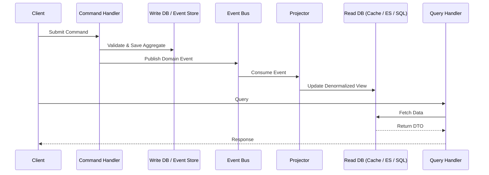

# Command Query Responsibility Segregation (CQRS)

## Overview

Command Query Responsibility Segregation (CQRS) is an architectural pattern that elevates Bertrand Meyer's **Command-Query Separation (CQS)** principle from the method level to the service and system level. Instead of a single model handling both reads and writes, CQRS explicitly splits the system into two distinct sides:

- **Commands (Write Side):** Handles state-changing operations. Commands are imperative intent (e.g., `PlaceOrder`, `CancelBooking`). They should not return data; they return success/failure.
- **Queries (Read Side):** Handles data retrieval. Queries are side-effect free requests (e.g., `GetOrderSummary`). They never mutate state.

> *"CQRS stands for Command Query Responsibility Segregation. It's a pattern that I first heard described by Greg Young. At its heart is the notion that you can use a different model to update information than the model you use to read information."* — **Martin Fowler**

This separation allows each side to be independently optimized, scaled, and evolved, making it a cornerstone of Domain-Driven Design (DDD) and Event-Driven Architecture (EDA).

---

## Why CQRS?

Traditional CRUD architectures force a single model to serve dual purposes. This creates a set of recurring problems:

| Problem | Single Model (CRUD) | CQRS Solution |
|---|---|---|
| **Complexity** | The domain model becomes polluted with query-specific logic (DTOs, projections, caching). | Write model stays pure; read model is simple data retrieval. |
| **Performance** | One database schema must serve both normalized writes and denormalized reporting. | Each side can use the best storage engine (normalized RDBMS for writes, Elasticsearch/Redis for reads). |
| **Scalability** | Reads and writes must scale together. | Read and write models can scale independently (e.g., 10 replicas for reads, 1 primary for writes). |
| **Security** | Read/write permissions are tangled in complex role-based logic. | Clear boundaries: commands require write permissions, queries require read permissions. |
| **Contention** | Write locks block reads; complex queries block writes. | No contention: the write model commits immediately; reads hit a completely separate store. |
| **Team Autonomy** | One model forces a single team to own the entire data layer. | Different teams can own the command model and the query model. |

---

## Core Concepts

### Commands
- Represent **intent**.
- Named imperatively or in past tense (`PlaceOrder`, `MarkInvoiceAsPaid`).
- **Do not return data** (only acknowledgement or errors).
- Validated against business rules **before** being processed.
- Typically enqueued on a command bus or message queue.

### Queries
- Represent a **request for data**.
- Named declaratively (`GetOrderSummary`, `FindAvailableProducts`).
- **Should not produce side effects**.
- Return **DTOs** or read-only view models.
- Executed against a highly optimized read store.

### Command Model (Write Side)
- Enforces business invariants.
- Often uses Aggregates (DDD) to ensure consistency.
- Publishes domain events after state changes.
- Storage: typically an event store (Event Sourcing) or a normalized relational database.

### Query Model (Read Side)
- Purely returns data.
- Uses denormalized tables, materialized views, or specialized search indexes.
- Updated **asynchronously** via event projections.
- Can be completely rebuilt from the event stream.

### Projections & Eventual Consistency
The glue between the two sides is the **event projector** (or subscriber). When a command publishes a domain event (e.g., `OrderPlacedEvent`), an event handler updates the read model.



---

## Key Features

### 1. Separate Models
The write model focuses on **consistency and behavior**. The read model focuses on **performance and shape**. They can be in different databases, different schemas, or different programming languages.

### 2. Task-Based Commands
Commands are expressed in the **Ubiquitous Language** of the domain, not as generic CRUD verbs. This improves communication between domain experts and developers.
- **Bad:** `UpdateOrderStatus(someBool)`
- **Good:** `ApproveOrder`, `FlagForFraudReview`, `ShipOrder`

### 3. Eventual Consistency
The read side is usually updated asynchronously. This means the read model may lag slightly behind the write model. This is a conscious tradeoff. Highly transactional systems (banking ledgers) might require careful handling, but most systems tolerate sub-second eventual consistency.

### 4. Independent Scaling
- **Write Model:** Scale vertically for transactional throughput, or scale horizontally by Sharding by Aggregate.
- **Read Model:** Scale horizontally using read replicas, caching layers (Redis), or search engines (Elasticsearch).

### 5. Event Sourcing Compatibility
CQRS pairs naturally with Event Sourcing (ES). In this combination:
- Commands generate **events**.
- The write store is an **event store** (append-only log).
- The read models are **projections** built from the event stream.
- Full audit trail and temporal queries become trivial.

### 6. Enhanced Testability
The write model can be unit tested in isolation (pure domain logic). The read model can be tested against known state. Integration tests validate that events are projected correctly.

---

## When to Use / When to Avoid

### Use CQRS When:
- Your domain is complex and the same model creates significant drag on development.
- The **read workload** is dramatically different from the **write workload** (e.g., operational writes vs. complex analytical queries).
- You need **auditability** and full **history** of state changes (pair with Event Sourcing).
- Your system must scale reads and writes independently.
- Your team is organized around **Bounded Contexts** in a microservices architecture.

### Avoid CQRS When:
- Your application is simple **CRUD** with minimal business logic (e.g., a basic blog or CMS). CQRS adds accidental complexity.
- Strong **immediate consistency** between reads and writes is mandatory (though this can be mitigated with specific patterns).
- Your team is small and unfamiliar with distributed systems patterns.
- The overhead of maintaining two models cannot be justified by the business value.

---

## Implementation Blueprint (with Code Examples)

CQRS is an architectural pattern. The "installation" is adopting a framework or structuring your application layer accordingly.

### Installation / Setup

#### .NET (MediatR & Dapper)
```bash
dotnet add package MediatR
dotnet add package Dapper
dotnet add package Microsoft.Data.SqlClient
```

#### Java (Axon Framework)
```xml
<dependency>
    <groupId>org.axonframework</groupId>
    <artifactId>axon-spring-boot-starter</artifactId>
    <version>4.9.3</version>
</dependency>
```

#### Node.js (Command Bus + Materialized Views)
```bash
npm install @nestjs/cqrs
```

---

### Example: E-Commerce Inventory System

#### 1. Define a Command (Write Side)

```csharp
// C# / MediatR
public record ReserveInventoryCommand(
    string ProductId,
    int Quantity,
    Guid OrderId
) : IRequest<Result>;
```

#### 2. Define the Command Handler

The handler operates exclusively on the **Write Model** (the Aggregate).

```csharp
public class ReserveInventoryHandler : IRequestHandler<ReserveInventoryCommand, Result>
{
    private readonly IInventoryRepository _repository;
    private readonly IEventBus _eventBus;

    public ReserveInventoryHandler(IInventoryRepository repository, IEventBus eventBus)
    {
        _repository = repository;
        _eventBus = eventBus;
    }

    public async Task<Result> Handle(ReserveInventoryCommand command, CancellationToken ct)
    {
        // 1. Load or create the aggregate
        var product = await _repository.LoadAsync(command.ProductId);

        // 2. Apply business logic (this mutates state and raises domain events)
        var result = product.ReserveInventory(command.Quantity, command.OrderId);
        if (result.IsFailure)
            return result;

        // 3. Persist the aggregate (or append events)
        await _repository.SaveAsync(product);

        // 4. Publish domain events (consumed by projectors)
        foreach (var domainEvent in product.DomainEvents)
            await _eventBus.Publish(domainEvent, ct);

        return Result.Success();
    }
}
```

#### 3. Define a Query (Read Side)

The query model is simple, side-effect free, and highly optimized for retrieval.

```csharp
public record GetAvailableStockQuery(string ProductId) : IRequest<int>;

public class GetAvailableStockHandler : IRequestHandler<GetAvailableStockQuery, int>
{
    // Direct dependency on a read-optimized store
    private readonly IDbConnection _readDb;

    public GetAvailableStockHandler(IDbConnection readDb) => _readDb = readDb;

    public async Task<int> Handle(GetAvailableStockQuery query, CancellationToken ct)
    {
        // Query a denormalized materialized view
        const string sql = "SELECT AvailableQuantity FROM InventoryReadModel WHERE ProductId = @ProductId";
        return await _readDb.QuerySingleAsync<int>(sql, new { query.ProductId });
    }
}
```

#### 4. Synchronize through Projections (Event Subscription)

A projector listens for domain events and updates the read model.

```csharp
public class InventoryReservedProjector : IEventHandler<InventoryReservedEvent>
{
    private readonly IReadModelDbContext _db;

    public InventoryReservedProjector(IReadModelDbContext db) => _db = db;

    public async Task Handle(InventoryReservedEvent @event, CancellationToken ct)
    {
        // Denormalize and upsert the read model
        await _db.ExecuteAsync(
            "UPDATE InventoryReadModel " +
            "SET ReservedQuantity = ReservedQuantity + @Quantity " +
            "WHERE ProductId = @ProductId",
            new { @event.ProductId, @event.Quantity }
        );
    }
}
```

#### 5. Dispatching (API Controller)

```csharp
[ApiController]
[Route("api/inventory")]
public class InventoryController : ControllerBase
{
    private readonly IMediator _mediator;

    public InventoryController(IMediator mediator) => _mediator = mediator;

    // Write
    [HttpPost("reserve")]
    public async Task<ActionResult> Reserve(ReserveInventoryCommand command)
    {
        var result = await _mediator.Send(command);
        return result.IsSuccess ? Accepted() : BadRequest(result.Error);
    }

    // Read
    [HttpGet("stock")]
    public async Task<ActionResult<int>> GetStock([FromQuery] string productId)
    {
        var stock = await _mediator.Send(new GetAvailableStockQuery(productId));
        return Ok(stock);
    }
}
```

---

## Practical Considerations

### Consistency Models
- **Eventual Consistency (Default):** Reads may be stale. Handle in the UI (e.g., "Order submitted… processing…").
- **Strong Consistency:** For critical paths, use a write-through cache or same-store reads. CQRS does not mandate eventual consistency everywhere.

### Command Return Values
Commands should ideally return **no domain data**, only a status (`Accepted`, `BadRequest`, `NotFound`). If the client needs an ID, return it from the command bus, or return a `Location` header.

### Validation
- **Input Validation:** Validate command syntax immediately (e.g., empty fields).
- **Business Validation:** Validate business rules inside the Command Handler / Aggregate.

### Versioning
When the read model schema changes, you can rebuild it by replaying events from the event store. This is a significant operational advantage of CQRS + Event Sourcing.

---

## Frameworks & Tools

| Framework | Language | Notes |
|---|---|---|
| **Axon Framework** | Java / Kotlin | The most mature JVM CQRS/ES framework. Full command bus, event bus, sagas. |
| **MediatR** | .NET | Simple in-process mediator. Excellent for getting started with CQRS without a message broker. |
| **Eventuate** | Java / Spring | Microservices-oriented CQRS/ES framework. |
| **Dapr** | Polyglot | Provides State Store (for write), Pub/Sub + Input Bindings (for projections). Ideal for distributed CQRS. |
| **Rebus** | .NET | Messaging library that naturally supports a distributed command/event pipeline. |
| **NServiceBus** | .NET | Enterprise-grade messaging with built-in saga support. |
| **Ecotone** | PHP | CQRS/ES framework for the PHP ecosystem. |
| **CQRS.js / NestJS CQRS** | Node.js | Native support in NestJS via `@nestjs/cqrs`. |

---

## Relationships to Other Patterns

| Pattern | Relationship |
|---|---|
| **Event Sourcing** | Stores events as the primary source of truth. The write model in CQRS is very often an Event Store. This combination provides full auditability. |
| **Domain-Driven Design** | The write side is a natural fit for DDD Aggregates. Commands directly map to Domain Events. |
| **Event-Driven Architecture** | CQRS is often implemented on top of an Event Broker (Kafka, RabbitMQ, Event Grid). Projections are consumer groups. |
| **CQRS vs CQS** | CQS operates at the method level. CQRS operates at the service/component level. Every CQRS system is implicitly CQS, but not vice versa. |
| **Hexagonal Architecture / Ports & Adapters** | CQRS fits naturally: Commands/Queries are inbound ports. Persistence databases are outbound adapters. |

---

## Conclusion

CQRS is a powerful, battle-tested architectural pattern that brings clarity, performance, and scalability to complex systems. It is not a silver bullet; it introduces significant infrastructure and consistency complexity. However, when applied within the correct Bounded Contexts—particularly in high-performance, event-driven, or domain-complex systems—CQRS provides a level of architectural flexibility that traditional CRUD models simply cannot match.

**Start small:** Apply CQRS to one Bounded Context that has drastically different read/write workloads. Use a simple mediator library for your first implementation. If the complexity becomes justified, introduce Event Sourcing and a message broker.

> *"CQRS is a simple pattern. The hard part is understanding when to use it."* — **Greg Young**