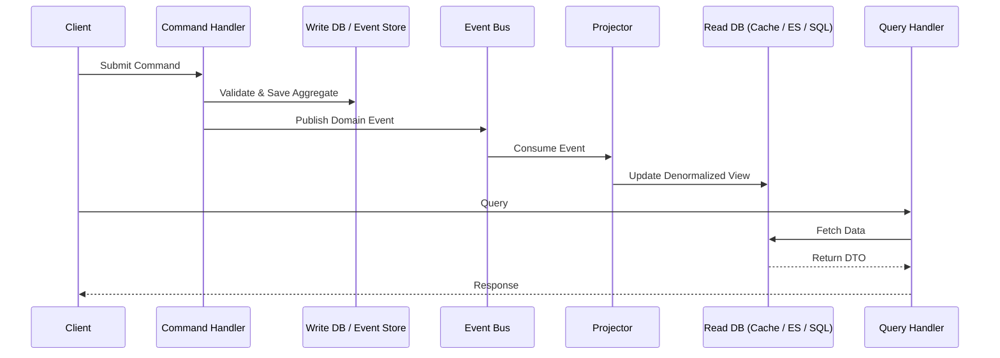

# Segregación de Responsabilidad de Comandos y Consultas (CQRS)

## Visión general

La Segregación de Responsabilidad de Comandos y Consultas (CQRS) es un patrón arquitectónico que eleva el principio de **Separación de Comandos y Consultas (CQS)** de Bertrand Meyer desde el nivel de método al nivel de servicio y sistema. En lugar de un modelo único que maneje tanto lecturas como escrituras, CQRS divide explícitamente el sistema en dos lados distintos:

- **Comandos (Lado de Escritura):** Maneja operaciones que cambian el estado. Los comandos son intenciones imperativas (por ejemplo, `PlaceOrder`, `CancelBooking`). No deben devolver datos; solo devuelven éxito/fracaso.
- **Consultas (Lado de Lectura):** Maneja la recuperación de datos. Las consultas son solicitudes sin efectos secundarios (por ejemplo, `GetOrderSummary`). Nunca mutan el estado.

> *"CQRS significa Command Query Responsibility Segregation. Es un patrón que escuché describir por primera vez a Greg Young. En esencia, se basa en la noción de que puedes usar un modelo diferente para actualizar información que el modelo que usas para leer información."* — **Martin Fowler**

Esta separación permite que cada lado sea optimizado, escalado y evolucionado de forma independiente, convirtiéndolo en una piedra angular del Diseño Guiado por el Dominio (DDD) y la Arquitectura Orientada a Eventos (EDA).

---

## ¿Por qué CQRS?

Las arquitecturas CRUD tradicionales fuerzan a un único modelo a servir propósitos duales. Esto crea un conjunto recurrente de problemas:

| Problema | Modelo Único (CRUD) | Solución CQRS |
|---|---|---|
| **Complejidad** | El modelo de dominio se contamina con lógica específica de consultas (DTOs, proyecciones, caché). | El modelo de escritura se mantiene puro; el modelo de lectura es simple recuperación de datos. |
| **Rendimiento** | Un solo esquema de base de datos debe servir tanto escrituras normalizadas como informes desnormalizados. | Cada lado puede usar el motor de almacenamiento más adecuado (RDBMS normalizado para escrituras, Elasticsearch/Redis para lecturas). |
| **Escalabilidad** | Las lecturas y escrituras deben escalar juntas. | Los modelos de lectura y escritura pueden escalar independientemente (por ejemplo, 10 réplicas para lecturas, 1 primario para escrituras). |
| **Seguridad** | Los permisos de lectura/escritura están enredados en lógica compleja basada en roles. | Límites claros: los comandos requieren permisos de escritura, las consultas requieren permisos de lectura. |
| **Contención** | Los bloqueos de escritura bloquean las lecturas; las consultas complejas bloquean las escrituras. | Sin contención: el modelo de escritura confirma inmediatamente; las lecturas se realizan en un almacén completamente separado. |
| **Autonomía del Equipo** | Un modelo obliga a un solo equipo a ser dueño de toda la capa de datos. | Diferentes equipos pueden ser dueños del modelo de comandos y del modelo de consultas. |

---

## Conceptos Clave

### Comandos
- Representan **intención**.
- Nombrados de forma imperativa o en tiempo pasado (`PlaceOrder`, `MarkInvoiceAsPaid`).
- **No devuelven datos** (solo acuse de recibo o errores).
- Validados contra reglas de negocio **antes** de ser procesados.
- Típicamente encolados en un bus de comandos o cola de mensajes.

### Consultas
- Representan una **solicitud de datos**.
- Nombradas de forma declarativa (`GetOrderSummary`, `FindAvailableProducts`).
- **No deben producir efectos secundarios**.
- Devuelven **DTOs** o modelos de vista de solo lectura.
- Ejecutadas contra un almacén de lectura altamente optimizado.

### Modelo de Comandos (Lado de Escritura)
- Hace cumplir los invariantes de negocio.
- A menudo utiliza Agregados (DDD) para garantizar la consistencia.
- Publica eventos de dominio después de cambios de estado.
- Almacenamiento: típicamente un almacén de eventos (Event Sourcing) o una base de datos relacional normalizada.

### Modelo de Consultas (Lado de Lectura)
- Simplemente devuelve datos.
- Utiliza tablas desnormalizadas, vistas materializadas o índices de búsqueda especializados.
- Actualizado **asincrónicamente** mediante proyecciones de eventos.
- Puede reconstruirse completamente a partir del flujo de eventos.

### Proyecciones y Consistencia Eventual
El pegamento entre los dos lados es el **proyector de eventos** (o suscriptor). Cuando un comando publica un evento de dominio (por ejemplo, `OrderPlacedEvent`), un manejador de eventos actualiza el modelo de lectura.



---

## Características Clave

### 1. Modelos Separados
El modelo de escritura se enfoca en **consistencia y comportamiento**. El modelo de lectura se enfoca en **rendimiento y forma**. Pueden estar en bases de datos diferentes, esquemas diferentes o lenguajes de programación diferentes.

### 2. Comandos Basados en Tareas
Los comandos se expresan en el **Lenguaje ubicuo** del dominio, no como verbos CRUD genéricos. Esto mejora la comunicación entre expertos del dominio y desarrolladores.
- **Malo:** `UpdateOrderStatus(someBool)`
- **Bueno:** `ApproveOrder`, `FlagForFraudReview`, `ShipOrder`

### 3. Consistencia Eventual
El lado de lectura generalmente se actualiza de forma asíncrona. Esto significa que el modelo de lectura puede retrasarse ligeramente respecto al modelo de escritura. Esta es una compensación consciente. Los sistemas altamente transaccionales (libros contables bancarios) pueden requerir un manejo cuidadoso, pero la mayoría de los sistemas toleran una consistencia eventual de menos de un segundo.

### 4. Escalado Independiente
- **Modelo de Escritura:** Escalar verticalmente para rendimiento transaccional, o escalar horizontalmente mediante fragmentación por Agregado.
- **Modelo de Lectura:** Escalar horizontalmente usando réplicas de lectura, capas de caché (Redis) o motores de búsqueda (Elasticsearch).

### 5. Compatibilidad con Event Sourcing
CQRS se combina naturalmente con Event Sourcing (ES). En esta combinación:
- Los comandos generan **eventos**.
- El almacén de escritura es un **almacén de eventos** (registro de solo añadidura).
- Los modelos de lectura son **proyecciones** construidas a partir del flujo de eventos.
- La auditoría completa y las consultas temporales se vuelven triviales.

### 6. Mejor Capacidad de Prueba
El modelo de escritura se puede probar unitariamente de forma aislada (lógica de dominio pura). El modelo de lectura se puede probar contra un estado conocido. Las pruebas de integración validan que los eventos se proyecten correctamente.

---

## Cuándo Usar / Cuándo Evitar

### Usar CQRS Cuando:
- Su dominio es complejo y el mismo modelo crea una ralentización significativa en el desarrollo.
- La **carga de trabajo de lectura** es dramáticamente diferente de la **carga de trabajo de escritura** (por ejemplo, escrituras operativas versus consultas analíticas complejas).
- Necesita **auditabilidad** e **historial completo** de cambios de estado (combinar con Event Sourcing).
- Su sistema debe escalar lecturas y escrituras de forma independiente.
- Su equipo está organizado alrededor de **Contextos Delimitados** en una arquitectura de microservicios.

### Evitar CQRS Cuando:
- Su aplicación es **CRUD** simple con lógica de negocio mínima (por ejemplo, un blog básico o CMS). CQRS agrega complejidad accidental.
- Se requiere **consistencia inmediata** fuerte entre lecturas y escrituras (aunque esto se puede mitigar con patrones específicos).
- Su equipo es pequeño y no está familiarizado con patrones de sistemas distribuidos.
- La sobrecarga de mantener dos modelos no puede justificarse por el valor de negocio.

---

## Plano de Implementación (con Ejemplos de Código)

CQRS es un patrón arquitectónico. La "instalación" consiste en adoptar un framework o estructurar su capa de aplicación en consecuencia.

### Instalación / Configuración

#### .NET (MediatR y Dapper)
```bash
dotnet add package MediatR
dotnet add package Dapper
dotnet add package Microsoft.Data.SqlClient
```

#### Java (Axon Framework)
```xml
<dependency>
    <groupId>org.axonframework</groupId>
    <artifactId>axon-spring-boot-starter</artifactId>
    <version>4.9.3</version>
</dependency>
```

#### Node.js (Command Bus + Materialized Views)
```bash
npm install @nestjs/cqrs
```

---

### Ejemplo: Sistema de Inventario de Comercio Electrónico

#### 1. Definir un Comando (Lado de Escritura)

```csharp
// C# / MediatR
public record ReserveInventoryCommand(
    string ProductId,
    int Quantity,
    Guid OrderId
) : IRequest<Result>;
```

#### 2. Definir el Manejador de Comandos

El manejador opera exclusivamente en el **Modelo de Escritura** (el Agregado).

```csharp
public class ReserveInventoryHandler : IRequestHandler<ReserveInventoryCommand, Result>
{
    private readonly IInventoryRepository _repository;
    private readonly IEventBus _eventBus;

    public ReserveInventoryHandler(IInventoryRepository repository, IEventBus eventBus)
    {
        _repository = repository;
        _eventBus = eventBus;
    }

    public async Task<Result> Handle(ReserveInventoryCommand command, CancellationToken ct)
    {
        // 1. Load or create the aggregate
        var product = await _repository.LoadAsync(command.ProductId);

        // 2. Apply business logic (this mutates state and raises domain events)
        var result = product.ReserveInventory(command.Quantity, command.OrderId);
        if (result.IsFailure)
            return result;

        // 3. Persist the aggregate (or append events)
        await _repository.SaveAsync(product);

        // 4. Publish domain events (consumed by projectors)
        foreach (var domainEvent in product.DomainEvents)
            await _eventBus.Publish(domainEvent, ct);

        return Result.Success();
    }
}
```

#### 3. Definir una Consulta (Lado de Lectura)

El modelo de consulta es simple, sin efectos secundarios y altamente optimizado para la recuperación.

```csharp
public record GetAvailableStockQuery(string ProductId) : IRequest<int>;

public class GetAvailableStockHandler : IRequestHandler<GetAvailableStockQuery, int>
{
    // Direct dependency on a read-optimized store
    private readonly IDbConnection _readDb;

    public GetAvailableStockHandler(IDbConnection readDb) => _readDb = readDb;

    public async Task<int> Handle(GetAvailableStockQuery query, CancellationToken ct)
    {
        // Query a denormalized materialized view
        const string sql = "SELECT AvailableQuantity FROM InventoryReadModel WHERE ProductId = @ProductId";
        return await _readDb.QuerySingleAsync<int>(sql, new { query.ProductId });
    }
}
```

#### 4. Sincronizar mediante Proyecciones (Suscripción de Eventos)

Un proyector escucha eventos de dominio y actualiza el modelo de lectura.

```csharp
public class InventoryReservedProjector : IEventHandler<InventoryReservedEvent>
{
    private readonly IReadModelDbContext _db;

    public InventoryReservedProjector(IReadModelDbContext db) => _db = db;

    public async Task Handle(InventoryReservedEvent @event, CancellationToken ct)
    {
        // Denormalize and upsert the read model
        await _db.ExecuteAsync(
            "UPDATE InventoryReadModel " +
            "SET ReservedQuantity = ReservedQuantity + @Quantity " +
            "WHERE ProductId = @ProductId",
            new { @event.ProductId, @event.Quantity }
        );
    }
}
```

#### 5. Despacho (Controlador de API)

```csharp
[ApiController]
[Route("api/inventory")]
public class InventoryController : ControllerBase
{
    private readonly IMediator _mediator;

    public InventoryController(IMediator mediator) => _mediator = mediator;

    // Write
    [HttpPost("reserve")]
    public async Task<ActionResult> Reserve(ReserveInventoryCommand command)
    {
        var result = await _mediator.Send(command);
        return result.IsSuccess ? Accepted() : BadRequest(result.Error);
    }

    // Read
    [HttpGet("stock")]
    public async Task<ActionResult<int>> GetStock([FromQuery] string productId)
    {
        var stock = await _mediator.Send(new GetAvailableStockQuery(productId));
        return Ok(stock);
    }
}
```

---

## Consideraciones Prácticas

### Modelos de Consistencia
- **Consistencia Eventual (Por Defecto):** Las lecturas pueden estar desactualizadas. Manejar en la interfaz de usuario (por ejemplo, "Pedido enviado… procesando…").
- **Consistencia Fuerte:** Para rutas críticas, usar una caché de escritura directa o lecturas del mismo almacén. CQRS no exige consistencia eventual en todas partes.

### Valores de Retorno de Comandos
Los comandos idealmente deben devolver **ningún dato de dominio**, solo un estado (`Accepted`, `BadRequest`, `NotFound`). Si el cliente necesita un ID, devolverlo desde el bus de comandos o devolver un encabezado `Location`.

### Validación
- **Validación de Entrada:** Validar la sintaxis del comando inmediatamente (por ejemplo, campos vacíos).
- **Validación de Negocio:** Validar reglas de negocio dentro del Manejador de Comandos / Agregado.

### Versionado
Cuando el esquema del modelo de lectura cambia, se puede reconstruir reproduciendo eventos desde el almacén de eventos. Esta es una ventaja operativa significativa de CQRS + Event Sourcing.

---

## Frameworks y Herramientas

| Framework | Lenguaje | Notas |
|---|---|---|
| **Axon Framework** | Java / Kotlin | El framework CQRS/ES para JVM más maduro. Bus de comandos, bus de eventos, sagas completo. |
| **MediatR** | .NET | Mediator en proceso simple. Excelente para comenzar con CQRS sin un intermediario de mensajes. |
| **Eventuate** | Java / Spring | Framework CQRS/ES orientado a microservicios. |
| **Dapr** | Políglota | Proporciona State Store (para escritura), Pub/Sub + Input Bindings (para proyecciones). Ideal para CQRS distribuido. |
| **Rebus** | .NET | Biblioteca de mensajería que soporta naturalmente un pipeline distribuido de comandos/eventos. |
| **NServiceBus** | .NET | Mensajería de grado empresarial con soporte de sagas incorporado. |
| **Ecotone** | PHP | Framework CQRS/ES para el ecosistema PHP. |
| **CQRS.js / NestJS CQRS** | Node.js | Soporte nativo en NestJS mediante `@nestjs/cqrs`. |

---

## Relaciones con Otros Patrones

| Patrón | Relación |
|---|---|
| **Event Sourcing** | Almacena eventos como la fuente de verdad principal. El modelo de escritura en CQRS es muy a menudo un almacén de eventos. Esta combinación proporciona auditabilidad completa. |
| **Diseño Guiado por el Dominio (DDD)** | El lado de escritura es un ajuste natural para los Agregados de DDD. Los comandos se mapean directamente a Eventos de Dominio. |
| **Arquitectura Orientada a Eventos** | CQRS a menudo se implementa sobre un Broker de Eventos (Kafka, RabbitMQ, Event Grid). Las proyecciones son grupos de consumidores. |
| **CQRS vs CQS** | CQS opera al nivel de método. CQRS opera al nivel de servicio/componente. Cada sistema CQRS es implícitamente CQS, pero no al revés. |
| **Arquitectura Hexagonal / Puertos y Adaptadores** | CQRS encaja naturalmente: Comandos/Consultas son puertos de entrada. Las bases de datos de persistencia son adaptadores de salida. |

---

## Conclusión

CQRS es un patrón arquitectónico poderoso y probado en batalla que aporta claridad, rendimiento y escalabilidad a sistemas complejos. No es una bala de plata; introduce una infraestructura significativa y complejidad de consistencia. Sin embargo, cuando se aplica dentro de los Contextos Delimitados correctos—particularmente en sistemas de alto rendimiento, orientados a eventos o de dominio complejo—CQRS proporciona un nivel de flexibilidad arquitectónica que los modelos CRUD tradicionales simplemente no pueden igualar.

**Empiece pequeño:** Aplique CQRS a un Contexto Delimitado que tenga cargas de trabajo de lectura/escritura drásticamente diferentes. Use una biblioteca de mediador simple para su primera implementación. Si la complejidad se justifica, introduzca Event Sourcing y un intermediario de mensajes.

> *"CQRS es un patrón simple. La parte difícil es entender cuándo usarlo."* — **Greg Young**