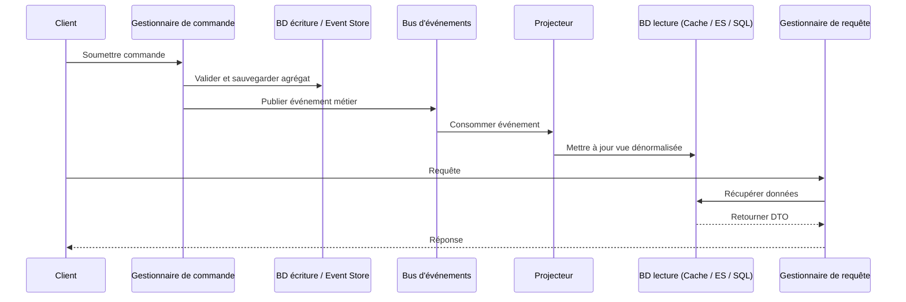

# Ségrégation des responsabilités commande-requête (CQRS)

## Aperçu

La ségrégation des responsabilités commande-requête (CQRS) est un modèle architectural qui élève le principe de **séparation commande-requête (CQS)** de Bertrand Meyer du niveau de la méthode au niveau du service et du système. Au lieu d'un modèle unique gérant à la fois les lectures et les écritures, CQRS divise explicitement le système en deux parties distinctes :

- **Commandes (côté écriture) :** gère les opérations de modification d'état. Les commandes expriment une intention impérative (ex. `PlacerCommande`, `AnnulerRéservation`). Elles ne doivent pas retourner de données ; elles retournent un succès ou un échec.
- **Requêtes (côté lecture) :** gère la récupération de données. Les requêtes sont des demandes sans effet de bord (ex. `ObtenirRésuméCommande`). Elles ne modifient jamais l'état.

> *« CQRS signifie Command Query Responsibility Segregation. C'est un modèle que j'ai entendu décrire pour la première fois par Greg Young. À son cœur se trouve l'idée que vous pouvez utiliser un modèle différent pour mettre à jour des informations que celui que vous utilisez pour lire les informations. »* — **Martin Fowler**

Cette séparation permet à chaque côté d'être indépendamment optimisé, mis à l'échelle et faire évoluer, ce qui en fait une pierre angulaire du Domain-Driven Design (DDD) et de l'architecture événementielle (EDA).

---

## Pourquoi CQRS ?

Les architectures CRUD traditionnelles imposent à un modèle unique de servir deux objectifs. Cela crée un ensemble de problèmes récurrents :

| Problème | Modèle unique (CRUD) | Solution CQRS |
|---|---|---|
| **Complexité** | Le modèle métier devient pollué par une logique spécifique aux requêtes (DTO, projections, cache). | Le modèle d'écriture reste pur ; le modèle de lecture est une simple récupération de données. |
| **Performances** | Le même schéma de base de données doit servir à la fois les écritures normalisées et les rapports dénormalisés. | Chaque côté peut utiliser le moteur de stockage le plus adapté (SGBDR normalisé pour les écritures, Elasticsearch/Redis pour les lectures). |
| **Scalabilité** | Les lectures et les écritures doivent évoluer ensemble. | Les modèles de lecture et d'écriture peuvent évoluer indépendamment (ex. 10 réplicas pour les lectures, 1 primaire pour les écritures). |
| **Sécurité** | Les droits de lecture/écriture sont mêlés dans une logique complexe basée sur les rôles. | Frontières claires : les commandes nécessitent des droits d'écriture, les requêtes des droits de lecture. |
| **Contention** | Les verrous en écriture bloquent les lectures ; les requêtes complexes bloquent les écritures. | Pas de contention : le modèle d'écriture s'engage immédiatement ; les lectures accèdent à un magasin complètement séparé. |
| **Autonomie des équipes** | Un modèle unique force une seule équipe à posséder toute la couche de données. | Différentes équipes peuvent posséder le modèle de commande et le modèle de requête. |

---

## Concepts fondamentaux

### Commandes
- Représentent **l'intention**.
- Nommées impérativement ou au passé (`PlacerCommande`, `MarquerFactureCommePayée`).
- **Ne retournent pas de données** (seulement un accusé de réception ou des erreurs).
- Validées par rapport aux règles métier **avant** d'être traitées.
- Généralement placées dans une file d'attente sur un bus de commandes ou une file de messages.

### Requêtes
- Représentent une **demande de données**.
- Nommées de manière déclarative (`ObtenirRésuméCommande`, `TrouverProduitsDisponibles`).
- **Ne devraient pas produire d'effets de bord**.
- Retournent des **DTO** ou des modèles de vue en lecture seule.
- Exécutées contre un magasin de lecture hautement optimisé.

### Modèle de commande (côté écriture)
- Applique les invariants métier.
- Utilise souvent des agrégats (DDD) pour garantir la cohérence.
- Publie des événements métier après les changements d'état.
- Stockage : généralement un event store (Event Sourcing) ou une base de données relationnelle normalisée.

### Modèle de requête (côté lecture)
- Retourne purement des données.
- Utilise des tables dénormalisées, des vues matérialisées, ou des index de recherche spécialisés.
- Mis à jour **de manière asynchrone** via des projections d'événements.
- Peut être complètement reconstruit à partir du flux d'événements.

### Projections et cohérence éventuelle
Le lien entre les deux côtés est le **projecteur d'événements** (ou abonné). Lorsqu'une commande publie un événement métier (ex. `ÉvénementCommandePlacée`), un gestionnaire d'événements met à jour le modèle de lecture.



---

## Caractéristiques principales

### 1. Modèles séparés
Le modèle d'écriture se concentre sur la **cohérence et le comportement**. Le modèle de lecture se concentre sur la **performance et la forme**. Ils peuvent être dans des bases de données différentes, des schémas différents, ou des langages de programmation différents.

### 2. Commandes basées sur les tâches
Les commandes sont exprimées dans le **langage ubiquitaire** du domaine, pas sous forme de verbes CRUD génériques. Cela améliore la communication entre les experts métier et les développeurs.
- **Mauvais :** `MettreÀJourStatutCommande(unBooléen)`
- **Bon :** `ApprouverCommande`, `SignalerPourExamenFraude`, `ExpédierCommande`

### 3. Cohérence éventuelle
Le côté lecture est généralement mis à jour de manière asynchrone. Cela signifie que le modèle de lecture peut être légèrement en retard par rapport au modèle d'écriture. C'est un compromis conscient. Les systèmes hautement transactionnels (livres de comptes bancaires) peuvent nécessiter une gestion prudente, mais la plupart des systèmes tolèrent une cohérence éventuelle inférieure à la seconde.

### 4. Mise à l'échelle indépendante
- **Modèle d'écriture :** mise à l'échelle verticale pour le débit transactionnel, ou horizontale par partitionnement par agrégat.
- **Modèle de lecture :** mise à l'échelle horizontale à l'aide de réplicas de lecture, de couches de cache (Redis) ou de moteurs de recherche (Elasticsearch).

### 5. Compatibilité avec l'Event Sourcing
CQRS s'associe naturellement à l'Event Sourcing (ES). Dans cette combinaison :
- Les commandes génèrent des **événements**.
- Le magasin d'écriture est un **event store** (journal en ajout seul).
- Les modèles de lecture sont des **projections** construites à partir du flux d'événements.
- La piste d'audit complète et les requêtes temporelles deviennent triviales.

### 6. Testabilité améliorée
Le modèle d'écriture peut être testé unitairement de manière isolée (logique métier pure). Le modèle de lecture peut être testé par rapport à un état connu. Les tests d'intégration valident que les événements sont correctement projetés.

---

## Quand l'utiliser / Quand l'éviter

### Utiliser CQRS quand :
- Votre domaine est complexe et le même modèle crée un frein significatif au développement.
- La **charge de lecture** est radicalement différente de la **charge d'écriture** (ex. écritures opérationnelles vs requêtes analytiques complexes).
- Vous avez besoin d'**auditabilité** et de l'**historique** complet des changements d'état (associer avec Event Sourcing).
- Votre système doit faire évoluer les lectures et les écritures de manière indépendante.
- Votre équipe est organisée autour de **contextes délimités (Bounded Contexts)** dans une architecture microservices.

### Éviter CQRS quand :
- Votre application est un **CRUD** simple avec une logique métier minimale (ex. un blog ou CMS basique). CQRS ajoute une complexité inutile.
- Une **cohérence immédiate** forte entre les lectures et les écritures est obligatoire (bien que cela puisse être atténué avec des modèles spécifiques).
- Votre équipe est petite et peu familière avec les modèles de systèmes distribués.
- Le surcoût de maintenance de deux modèles ne peut pas être justifié par la valeur métier.

---

## Plan d'implémentation (avec exemples de code)

CQRS est un modèle architectural. L'« installation » consiste à adopter un framework ou à structurer votre couche d'application en conséquence.

### Installation / Configuration

#### .NET (MediatR & Dapper)
```bash
dotnet add package MediatR
dotnet add package Dapper
dotnet add package Microsoft.Data.SqlClient
```

#### Java (Axon Framework)
```xml
<dependency>
    <groupId>org.axonframework</groupId>
    <artifactId>axon-spring-boot-starter</artifactId>
    <version>4.9.3</version>
</dependency>
```

#### Node.js (Command Bus + Materialized Views)
```bash
npm install @nestjs/cqrs
```

---

### Exemple : Système de gestion de stock e-commerce

#### 1. Définir une commande (côté écriture)

```csharp
// C# / MediatR
public record ReserveInventoryCommand(
    string ProductId,
    int Quantity,
    Guid OrderId
) : IRequest<Result>;
```

#### 2. Définir le gestionnaire de commande

Le gestionnaire opère exclusivement sur le **modèle d'écriture** (l'agrégat).

```csharp
public class ReserveInventoryHandler : IRequestHandler<ReserveInventoryCommand, Result>
{
    private readonly IInventoryRepository _repository;
    private readonly IEventBus _eventBus;

    public ReserveInventoryHandler(IInventoryRepository repository, IEventBus eventBus)
    {
        _repository = repository;
        _eventBus = eventBus;
    }

    public async Task<Result> Handle(ReserveInventoryCommand command, CancellationToken ct)
    {
        // 1. Charger ou créer l'agrégat
        var product = await _repository.LoadAsync(command.ProductId);

        // 2. Appliquer la logique métier (cela modifie l'état et déclenche des événements métier)
        var result = product.ReserveInventory(command.Quantity, command.OrderId);
        if (result.IsFailure)
            return result;

        // 3. Persister l'agrégat (ou ajouter les événements)
        await _repository.SaveAsync(product);

        // 4. Publier les événements métier (consommés par les projecteurs)
        foreach (var domainEvent in product.DomainEvents)
            await _eventBus.Publish(domainEvent, ct);

        return Result.Success();
    }
}
```

#### 3. Définir une requête (côté lecture)

Le modèle de requête est simple, sans effet de bord et hautement optimisé pour la récupération.

```csharp
public record GetAvailableStockQuery(string ProductId) : IRequest<int>;

public class GetAvailableStockHandler : IRequestHandler<GetAvailableStockQuery, int>
{
    // Dépendance directe sur un magasin optimisé pour la lecture
    private readonly IDbConnection _readDb;

    public GetAvailableStockHandler(IDbConnection readDb) => _readDb = readDb;

    public async Task<int> Handle(GetAvailableStockQuery query, CancellationToken ct)
    {
        // Interroger une vue matérialisée dénormalisée
        const string sql = "SELECT AvailableQuantity FROM InventoryReadModel WHERE ProductId = @ProductId";
        return await _readDb.QuerySingleAsync<int>(sql, new { query.ProductId });
    }
}
```

#### 4. Synchroniser via des projections (abonnement aux événements)

Un projecteur écoute les événements métier et met à jour le modèle de lecture.

```csharp
public class InventoryReservedProjector : IEventHandler<InventoryReservedEvent>
{
    private readonly IReadModelDbContext _db;

    public InventoryReservedProjector(IReadModelDbContext db) => _db = db;

    public async Task Handle(InventoryReservedEvent @event, CancellationToken ct)
    {
        // Dénormaliser et mettre à jour le modèle de lecture (upsert)
        await _db.ExecuteAsync(
            "UPDATE InventoryReadModel " +
            "SET ReservedQuantity = ReservedQuantity + @Quantity " +
            "WHERE ProductId = @ProductId",
            new { @event.ProductId, @event.Quantity }
        );
    }
}
```

#### 5. Distribution (contrôleur API)

```csharp
[ApiController]
[Route("api/inventory")]
public class InventoryController : ControllerBase
{
    private readonly IMediator _mediator;

    public InventoryController(IMediator mediator) => _mediator = mediator;

    // Écriture
    [HttpPost("reserve")]
    public async Task<ActionResult> Reserve(ReserveInventoryCommand command)
    {
        var result = await _mediator.Send(command);
        return result.IsSuccess ? Accepted() : BadRequest(result.Error);
    }

    // Lecture
    [HttpGet("stock")]
    public async Task<ActionResult<int>> GetStock([FromQuery] string productId)
    {
        var stock = await _mediator.Send(new GetAvailableStockQuery(productId));
        return Ok(stock);
    }
}
```

---

## Considérations pratiques

### Modèles de cohérence
- **Cohérence éventuelle (par défaut) :** Les lectures peuvent être obsolètes. Gérez cela dans l'interface utilisateur (ex. « Commande soumise… traitement en cours… »).
- **Cohérence forte :** Pour les chemins critiques, utilisez un cache à écriture directe ou des lectures sur le même magasin. CQRS n'impose pas une cohérence éventuelle partout.

### Valeurs de retour des commandes
Les commandes devraient idéalement ne retourner **aucune donnée métier**, seulement un statut (`Accepté`, `RequêteInvalide`, `NonTrouvé`). Si le client a besoin d'un identifiant, retournez-le depuis le bus de commandes, ou retournez un en-tête `Location`.

### Validation
- **Validation des entrées :** Validez la syntaxe de la commande immédiatement (ex. champs vides).
- **Validation métier :** Validez les règles métier à l'intérieur du gestionnaire de commande / agrégat.

### Gestion des versions
Lorsque le schéma du modèle de lecture change, vous pouvez le reconstruire en rejouant les événements depuis l'event store. C'est un avantage opérationnel significatif de CQRS + Event Sourcing.

---

## Frameworks & Outils

| Framework | Langage | Remarques |
|---|---|---|
| **Axon Framework** | Java / Kotlin | Le framework JVM CQRS/ES le plus mature. Bus de commandes, bus d'événements, sagas complets. |
| **MediatR** | .NET | Simple médiateur in-process. Excellent pour démarrer avec CQRS sans courtier de messages. |
| **Eventuate** | Java / Spring | Framework CQRS/ES orienté microservices. |
| **Dapr** | Polyglotte | Fournit un State Store (pour l'écriture), Pub/Sub + liaisons d'entrée (pour les projections). Idéal pour CQRS distribué. |
| **Rebus** | .NET | Bibliothèque de messagerie qui supporte naturellement un pipeline commande/événement distribué. |
| **NServiceBus** | .NET | Messagerie de niveau entreprise avec support intégré des sagas. |
| **Ecotone** | PHP | Framework CQRS/ES pour l'écosystème PHP. |
| **CQRS.js / NestJS CQRS** | Node.js | Support natif dans NestJS via `@nestjs/cqrs`. |

---

## Relations avec d'autres modèles

| Modèle | Relation |
|---|---|
| **Event Sourcing** | Stocke les événements comme source principale de vérité. Le modèle d'écriture en CQRS est très souvent un Event Store. Cette combinaison offre une auditabilité complète. |
| **Domain-Driven Design** | Le côté écriture est un candidat naturel pour les agrégats DDD. Les commandes correspondent directement aux événements métier. |
| **Architecture événementielle** | CQRS est souvent implémenté sur un courtier d'événements (Kafka, RabbitMQ, Event Grid). Les projecteurs sont des groupes de consommateurs. |
| **CQRS vs CQS** | CQS opère au niveau de la méthode. CQRS opère au niveau du service/du composant. Tout système CQRS est implicitement CQS, mais l'inverse n'est pas vrai. |
| **Architecture hexagonale / Ports & Adaptateurs** | CQRS s'intègre naturellement : les commandes/requêtes sont des ports d'entrée. Les bases de données de persistance sont des adaptateurs de sortie. |

---

## Conclusion

CQRS est un modèle architectural puissant et éprouvé qui apporte clarté, performance et scalabilité aux systèmes complexes. Ce n'est pas une solution miracle ; il introduit une complexité significative d'infrastructure et de cohérence. Cependant, lorsqu'il est appliqué dans les contextes délimités appropriés—en particulier dans les systèmes à haute performance, événementiels ou à domaine complexe—CQRS offre un niveau de flexibilité architecturale que les modèles CRUD traditionnels ne peuvent tout simplement pas égaler.

**Commencez petit :** Appliquez CQRS à un seul contexte délimité qui a des charges de travail de lecture/écriture radicalement différentes. Utilisez une simple bibliothèque de médiateur pour votre première implémentation. Si la complexité devient justifiée, introduisez l'Event Sourcing et un courtier de messages.

> *« CQRS est un modèle simple. La partie difficile est de comprendre quand l'utiliser. »* — **Greg Young**