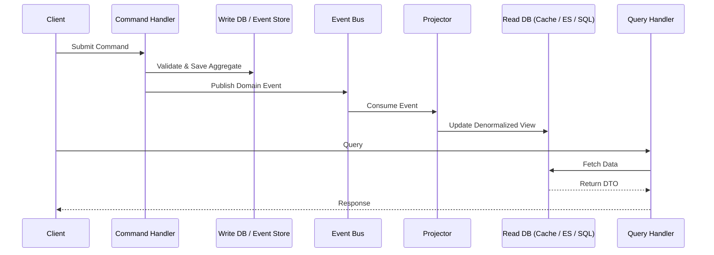

# コマンドクエリ責務分離 (CQRS)

## 概要

コマンドクエリ責務分離 (CQRS) は、Bertrand Meyerの**コマンドクエリ分離 (CQS)** 原則をメソッドレベルからサービスおよびシステムレベルに引き上げるアーキテクチャパターンです。読み取りと書き込みの両方を処理する単一のモデルではなく、CQRSはシステムを明示的に2つの異なる側面に分割します。

- **コマンド (書き込み側):** 状態を変更する操作を処理します。コマンドは命令的な意図を表します（例: `PlaceOrder`、`CancelBooking`）。データを返すべきではなく、成功/失敗を返します。
- **クエリ (読み取り側):** データ取得を処理します。クエリは副作用のないリクエストです（例: `GetOrderSummary`）。状態を変更することはありません。

> *"CQRSはCommand Query Responsibility Segregationの略です。これはGreg Youngが最初に説明したと聞いたパターンです。その核心は、情報を更新するモデルと情報を読み取るモデルに異なるモデルを使用できるという考え方です。"* — **Martin Fowler**

この分離により、各側面を独立して最適化、スケーリング、進化させることが可能になり、ドメイン駆動設計 (DDD) およびイベント駆動アーキテクチャ (EDA) の基盤となります。

---

## なぜCQRSか？

従来のCRUDアーキテクチャでは、単一のモデルが二重の目的を果たすことを強制されます。これにより、繰り返し発生する問題が生じます。

| 問題点 | 単一モデル (CRUD) | CQRSの解決策 |
|---|---|---|
| **複雑性** | ドメインモデルがクエリ固有のロジック（DTO、プロジェクション、キャッシュ）で汚染される。 | 書き込みモデルは純粋なまま；読み取りモデルは単純なデータ取得。 |
| **パフォーマンス** | 1つのデータベーススキーマが正規化された書き込みと非正規化されたレポートの両方に対応しなければならない。 | 各側面で最適なストレージエンジンを使用できる（書き込みには正規化RDBMS、読み取りにはElasticsearch/Redis）。 |
| **スケーラビリティ** | 読み取りと書き込みは一緒にスケーリングする必要がある。 | 読み取りモデルと書き込みモデルは独立してスケーリングできる（例: 読み取り用に10レプリカ、書き込み用に1プライマリ）。 |
| **セキュリティ** | 読み取り/書き込みの権限が複雑なロールベースのロジックに絡み合っている。 | 明確な境界：コマンドには書き込み権限、クエリには読み取り権限が必要。 |
| **競合** | 書き込みロックが読み取りをブロックし、複雑なクエリが書き込みをブロックする。 | 競合なし：書き込みモデルは即座にコミットし、読み取りは完全に別のストアにアクセスする。 |
| **チームの自律性** | 単一のモデルが1つのチームにデータレイヤー全体の所有を強制する。 | 異なるチームがコマンドモデルとクエリモデルを所有できる。 |

---

## コアコンセプト

### コマンド
- **意図**を表す。
- 命令形または過去形で命名される（`PlaceOrder`、`MarkInvoiceAsPaid`）。
- **データを返さない**（確認またはエラーのみ）。
- 処理される**前に**ビジネスルールに対して検証される。
- 通常、コマンドバスまたはメッセージキューにエンキューされる。

### クエリ
- **データへのリクエスト**を表す。
- 宣言的に命名される（`GetOrderSummary`、`FindAvailableProducts`）。
- **副作用を起こしてはならない**。
- **DTO** または読み取り専用のビューモデルを返す。
- 高度に最適化された読み取りストアに対して実行される。

### コマンドモデル (書き込み側)
- ビジネス不変条件を強制する。
- 一貫性を確保するためにアグリゲート (DDD) を頻繁に使用する。
- 状態変更後にドメインイベントを公開する。
- ストレージ: 典型的にはイベントストア (イベントソーシング) または正規化されたリレーショナルデータベース。

### クエリモデル (読み取り側)
- 純粋にデータを返す。
- 非正規化テーブル、マテリアライズドビュー、または特殊な検索インデックスを使用する。
- イベントプロジェクションを介して**非同期に**更新される。
- イベントストリームから完全に再構築可能。

### プロジェクションと結果整合性
2つの側面の接着剤は**イベントプロジェクター**（またはサブスクライバー）です。コマンドがドメインイベント（例: `OrderPlacedEvent`）を公開すると、イベントハンドラーが読み取りモデルを更新します。



---

## 主要機能

### 1. 分離されたモデル
書き込みモデルは**一貫性と振る舞い**に焦点を当てます。読み取りモデルは**パフォーマンスと形状**に焦点を当てます。これらは異なるデータベース、異なるスキーマ、または異なるプログラミング言語に配置することができます。

### 2. タスクベースのコマンド
コマンドは、一般的なCRUD動詞ではなく、ドメインの**ユビキタス言語**で表現されます。これにより、ドメインエキスパートと開発者間のコミュニケーションが向上します。
- **悪い例:** `UpdateOrderStatus(someBool)`
- **良い例:** `ApproveOrder`、`FlagForFraudReview`、`ShipOrder`

### 3. 結果整合性
読み取り側は通常、非同期に更新されます。つまり、読み取りモデルが書き込みモデルよりわずかに遅れる可能性があります。これは意図的なトレードオフです。高いトランザクション性が求められるシステム（銀行の台帳）では注意深い取り扱いが必要かもしれませんが、ほとんどのシステムはサブ秒の結果整合性を許容します。

### 4. 独立したスケーリング
- **書き込みモデル:** トランザクションスループットのために垂直スケーリング、またはアグリゲートによるシャーディングで水平スケーリング。
- **読み取りモデル:** 読み取りレプリカ、キャッシュ層 (Redis)、または検索エンジン (Elasticsearch) を使用して水平スケーリング。

### 5. イベントソーシングとの互換性
CQRSはイベントソーシング (ES) と自然に組み合わさります。この組み合わせでは:
- コマンドは**イベント**を生成します。
- 書き込みストアは**イベントストア**（追記専用ログ）です。
- 読み取りモデルはイベントストリームから構築された**プロジェクション**です。
- 完全な監査証跡と時間的クエリが容易になります。

### 6. テスト容易性の向上
書き込みモデルは単体でユニットテストできます（純粋なドメインロジック）。読み取りモデルは既知の状態に対してテストできます。統合テストにより、イベントが正しく投影されることを検証します。

---

## 使用すべき場合と避けるべき場合

### CQRSを使用すべき場合:
- ドメインが複雑で、同じモデルが開発に大きな負担をかけている場合。
- **読み取りワークロード**が**書き込みワークロード**と著しく異なる場合（例: 運用上の書き込み vs. 複雑な分析クエリ）。
- 状態変更の**監査可能性**と完全な**履歴**が必要な場合（イベントソーシングと組み合わせる）。
- システムが読み取りと書き込みを独立してスケーリングする必要がある場合。
- チームがマイクロサービスアーキテクチャの**境界づけられたコンテキスト**を中心に組織されている場合。

### CQRSを避けるべき場合:
- アプリケーションが最小限のビジネスロジックしかない単純な**CRUD**である場合（例: 基本的なブログやCMS）。CQRSは偶発的な複雑さを追加します。
- 読み取りと書き込み間の強力な**即時一貫性**が必須である場合（ただし、特定のパターンで緩和可能）。
- チームが小さく、分散システムパターンに不慣れな場合。
- 2つのモデルを維持するオーバーヘッドがビジネス価値によって正当化できない場合。

---

## 実装の青写真（コード例付き）

CQRSはアーキテクチャパターンです。「インストール」とは、フレームワークを採用するか、アプリケーションレイヤーをそれに合わせて構造化することです。

### インストール / セットアップ

#### .NET (MediatR & Dapper)
```bash
dotnet add package MediatR
dotnet add package Dapper
dotnet add package Microsoft.Data.SqlClient
```

#### Java (Axon Framework)
```xml
<dependency>
    <groupId>org.axonframework</groupId>
    <artifactId>axon-spring-boot-starter</artifactId>
    <version>4.9.3</version>
</dependency>
```

#### Node.js (Command Bus + Materialized Views)
```bash
npm install @nestjs/cqrs
```

---

### 例: Eコマース在庫システム

#### 1. コマンドの定義 (書き込み側)

```csharp
// C# / MediatR
public record ReserveInventoryCommand(
    string ProductId,
    int Quantity,
    Guid OrderId
) : IRequest<Result>;
```

#### 2. コマンドハンドラーの定義

ハンドラーは**書き込みモデル**（アグリゲート）に対して排他的に動作します。

```csharp
public class ReserveInventoryHandler : IRequestHandler<ReserveInventoryCommand, Result>
{
    private readonly IInventoryRepository _repository;
    private readonly IEventBus _eventBus;

    public ReserveInventoryHandler(IInventoryRepository repository, IEventBus eventBus)
    {
        _repository = repository;
        _eventBus = eventBus;
    }

    public async Task<Result> Handle(ReserveInventoryCommand command, CancellationToken ct)
    {
        // 1. Load or create the aggregate
        var product = await _repository.LoadAsync(command.ProductId);

        // 2. Apply business logic (this mutates state and raises domain events)
        var result = product.ReserveInventory(command.Quantity, command.OrderId);
        if (result.IsFailure)
            return result;

        // 3. Persist the aggregate (or append events)
        await _repository.SaveAsync(product);

        // 4. Publish domain events (consumed by projectors)
        foreach (var domainEvent in product.DomainEvents)
            await _eventBus.Publish(domainEvent, ct);

        return Result.Success();
    }
}
```

#### 3. クエリの定義 (読み取り側)

クエリモデルはシンプルで副作用がなく、取得に高度に最適化されています。

```csharp
public record GetAvailableStockQuery(string ProductId) : IRequest<int>;

public class GetAvailableStockHandler : IRequestHandler<GetAvailableStockQuery, int>
{
    // Direct dependency on a read-optimized store
    private readonly IDbConnection _readDb;

    public GetAvailableStockHandler(IDbConnection readDb) => _readDb = readDb;

    public async Task<int> Handle(GetAvailableStockQuery query, CancellationToken ct)
    {
        // Query a denormalized materialized view
        const string sql = "SELECT AvailableQuantity FROM InventoryReadModel WHERE ProductId = @ProductId";
        return await _readDb.QuerySingleAsync<int>(sql, new { query.ProductId });
    }
}
```

#### 4. プロジェクションによる同期 (イベントサブスクリプション)

プロジェクターがドメインイベントをリッスンし、読み取りモデルを更新します。

```csharp
public class InventoryReservedProjector : IEventHandler<InventoryReservedEvent>
{
    private readonly IReadModelDbContext _db;

    public InventoryReservedProjector(IReadModelDbContext db) => _db = db;

    public async Task Handle(InventoryReservedEvent @event, CancellationToken ct)
    {
        // Denormalize and upsert the read model
        await _db.ExecuteAsync(
            "UPDATE InventoryReadModel " +
            "SET ReservedQuantity = ReservedQuantity + @Quantity " +
            "WHERE ProductId = @ProductId",
            new { @event.ProductId, @event.Quantity }
        );
    }
}
```

#### 5. ディスパッチ (APIコントローラー)

```csharp
[ApiController]
[Route("api/inventory")]
public class InventoryController : ControllerBase
{
    private readonly IMediator _mediator;

    public InventoryController(IMediator mediator) => _mediator = mediator;

    // Write
    [HttpPost("reserve")]
    public async Task<ActionResult> Reserve(ReserveInventoryCommand command)
    {
        var result = await _mediator.Send(command);
        return result.IsSuccess ? Accepted() : BadRequest(result.Error);
    }

    // Read
    [HttpGet("stock")]
    public async Task<ActionResult<int>> GetStock([FromQuery] string productId)
    {
        var stock = await _mediator.Send(new GetAvailableStockQuery(productId));
        return Ok(stock);
    }
}
```

---

## 実用的な考慮事項

### 整合性モデル
- **結果整合性 (デフォルト):** 読み取りが古い可能性があります。UIで処理します（例: 「注文送信…処理中…」）。
- **強整合性:** クリティカルなパスには、ライトスルーキャッシュまたは同じストアからの読み取りを使用します。CQRSはどこでも結果整合性を強制するわけではありません。

### コマンドの戻り値
コマンドは理想的には**ドメインデータを返さず**、ステータスのみを返すべきです（`Accepted`、`BadRequest`、`NotFound`）。クライアントがIDを必要とする場合は、コマンドバスから返すか、`Location`ヘッダーを返します。

### 検証
- **入力検証:** コマンドの構文を即座に検証します（例: 空のフィールド）。
- **ビジネス検証:** コマンドハンドラー/アグリゲート内でビジネスルールを検証します。

### バージョニング
読み取りモデルのスキーマが変更された場合、イベントストアからイベントを再生することで再構築できます。これはCQRS + イベントソーシングの重要な運用上の利点です。

---

## フレームワークとツール

| フレームワーク | 言語 | 備考 |
|---|---|---|
| **Axon Framework** | Java / Kotlin | 最も成熟したJVM CQRS/ESフレームワーク。完全なコマンドバス、イベントバス、サガ。 |
| **MediatR** | .NET | シンプルなインプロセスメディエーター。メッセージブローカーなしでCQRSを始めるのに最適。 |
| **Eventuate** | Java / Spring | マイクロサービス指向のCQRS/ESフレームワーク。 |
| **Dapr** | Polyglot | ステートストア（書き込み用）、Pub/Sub + 入力バインディング（プロジェクション用）を提供。分散CQRSに最適。 |
| **Rebus** | .NET | 分散コマンド/イベントパイプラインを自然にサポートするメッセージングライブラリ。 |
| **NServiceBus** | .NET | ビルトインのサガサポートを備えたエンタープライズグレードのメッセージング。 |
| **Ecotone** | PHP | PHPエコシステム向けのCQRS/ESフレームワーク。 |
| **CQRS.js / NestJS CQRS** | Node.js | `@nestjs/cqrs`を介してNestJSでネイティブサポート。 |

---

## 他のパターンとの関係

| パターン | 関係 |
|---|---|
| **イベントソーシング** | イベントを主要な真実のソースとして保存する。CQRSの書き込みモデルは非常に頻繁にイベントストアである。この組み合わせは完全な監査可能性を提供する。 |
| **ドメイン駆動設計** | 書き込み側はDDDアグリゲートに自然に適合する。コマンドはドメインイベントに直接マッピングされる。 |
| **イベント駆動アーキテクチャ** | CQRSはしばしばイベントブローカー（Kafka、RabbitMQ、Event Grid）上に実装される。プロジェクションはコンシューマーグループである。 |
| **CQRS vs CQS** | CQSはメソッドレベルで動作する。CQRSはサービス/コンポーネントレベルで動作する。すべてのCQRSシステムは暗黙的にCQSであるが、その逆は成り立たない。 |
| **ヘキサゴナルアーキテクチャ / ポートとアダプター** | CQRSは自然に適合する：コマンド/クエリはインバウンドポートであり、永続化データベースはアウトバウンドアダプターである。 |

---

## 結論

CQRSは強力で実戦で試されたアーキテクチャパターンであり、複雑なシステムに明確さ、パフォーマンス、スケーラビリティをもたらします。それは銀の弾丸ではありません。重要なインフラストラクチャと一貫性の複雑さを導入します。しかし、正しい境界づけられたコンテキスト内で適用された場合—特に高パフォーマンス、イベント駆動、またはドメイン複雑なシステムにおいて—CQRSは従来のCRUDモデルでは単純に達成できないレベルのアーキテクチャの柔軟性を提供します。

**小さく始める:** 読み取りと書き込みのワークロードが著しく異なる1つの境界づけられたコンテキストにCQRSを適用します。最初の実装にはシンプルなメディエーターライブラリを使用します。複雑さが正当化されたら、イベントソーシングとメッセージブローカーを導入します。

> *"CQRSはシンプルなパターンです。難しいのはいつ使うかを理解することです。"* — **Greg Young**