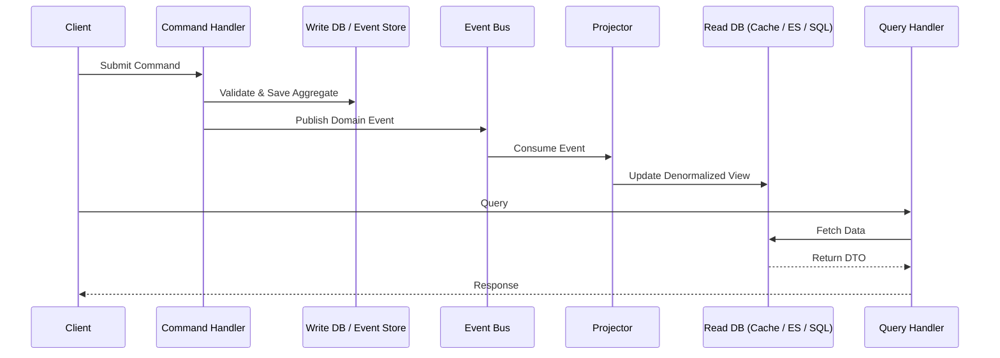

# Command Query Responsibility Segregation (CQRS)

## Visão Geral

Command Query Responsibility Segregation (CQRS) é um padrão arquitetural que eleva o princípio **Command-Query Separation (CQS)** de Bertrand Meyer do nível de método para o nível de serviço e sistema. Em vez de um único modelo lidando com leituras e escritas, o CQRS divide explicitamente o sistema em dois lados distintos:

- **Commands (Write Side):** Lida com operações que alteram o estado. Commands são intenções imperativas (ex.: `PlaceOrder`, `CancelBooking`). Eles não devem retornar dados; retornam sucesso/falha.
- **Queries (Read Side):** Lida com recuperação de dados. Queries são solicitações sem efeitos colaterais (ex.: `GetOrderSummary`). Elas nunca alteram o estado.

> *"CQRS significa Command Query Responsibility Segregation. É um padrão que ouvi pela primeira vez descrito por Greg Young. Em essência, a noção de que você pode usar um modelo diferente para atualizar informações do que o modelo usado para ler informações."* — **Martin Fowler**

Essa separação permite que cada lado seja otimizado, escalado e evoluído independentemente, tornando-se uma pedra angular do Domain-Driven Design (DDD) e da Event-Driven Architecture (EDA).

---

## Por que CQRS?

Arquiteturas tradicionais de CRUD forçam um único modelo a servir propósitos duais. Isso cria um conjunto de problemas recorrentes:

| Problema | Modelo Único (CRUD) | Solução CQRS |
|---|---|---|
| **Complexidade** | O modelo de domínio fica poluído com lógica específica de consulta (DTOs, projeções, cache). | O modelo de escrita permanece puro; o modelo de leitura é simples recuperação de dados. |
| **Desempenho** | Um esquema de banco de dados deve atender tanto escritas normalizadas quanto relatórios desnormalizados. | Cada lado pode usar o melhor mecanismo de armazenamento (RDBMS normalizado para escritas, Elasticsearch/Redis para leituras). |
| **Escalabilidade** | Leituras e escritas devem escalar juntas. | Modelos de leitura e escrita podem escalar independentemente (ex.: 10 réplicas para leituras, 1 primário para escritas). |
| **Segurança** | Permissões de leitura/escrita estão emaranhadas em lógica de papéis complexa. | Limites claros: commands exigem permissões de escrita, queries exigem permissões de leitura. |
| **Contenção** | Locks de escrita bloqueiam leituras; consultas complexas bloqueiam escritas. | Sem contenção: o modelo de escrita confirma imediatamente; as leituras atingem um armazenamento completamente separado. |
| **Autonomia da Equipe** | Um único modelo força uma única equipe a possuir toda a camada de dados. | Equipes diferentes podem possuir o modelo de comando e o modelo de consulta. |

---

## Conceitos Principais

### Commands
- Representam **intenção**.
- Nomeados no imperativo ou no passado (`PlaceOrder`, `MarkInvoiceAsPaid`).
- **Não retornam dados** (apenas confirmação ou erros).
- Validados contra regras de negócio **antes** de serem processados.
- Tipicamente enfileirados em um barramento de comandos ou fila de mensagens.

### Queries
- Representam uma **solicitação de dados**.
- Nomeados de forma declarativa (`GetOrderSummary`, `FindAvailableProducts`).
- **Não devem produzir efeitos colaterais**.
- Retornam **DTOs** ou modelos de visão somente leitura.
- Executados contra um armazenamento de leitura altamente otimizado.

### Command Model (Write Side)
- Impõe invariantes de negócio.
- Frequentemente usa Agregados (DDD) para garantir consistência.
- Publica eventos de domínio após alterações de estado.
- Armazenamento: tipicamente um event store (Event Sourcing) ou um banco de dados relacional normalizado.

### Query Model (Read Side)
- Retorna dados puramente.
- Usa tabelas desnormalizadas, views materializadas, ou índices de busca especializados.
- Atualizado **assincronamente** via projeções de eventos.
- Pode ser completamente reconstruído a partir do fluxo de eventos.

### Projections & Eventual Consistency
O elo entre os dois lados é o **projetor de eventos** (ou subscriber). Quando um comando publica um evento de domínio (ex.: `OrderPlacedEvent`), um manipulador de eventos atualiza o modelo de leitura.



---

## Recursos Principais

### 1. Modelos Separados
O modelo de escrita foca em **consistência e comportamento**. O modelo de leitura foca em **desempenho e forma**. Eles podem estar em bancos de dados diferentes, esquemas diferentes, ou linguagens de programação diferentes.

### 2. Comandos Baseados em Tarefas
Comandos são expressos na **Linguagem Ubíqua** do domínio, não como verbos genéricos de CRUD. Isso melhora a comunicação entre especialistas de domínio e desenvolvedores.
- **Ruim:** `UpdateOrderStatus(someBool)`
- **Bom:** `ApproveOrder`, `FlagForFraudReview`, `ShipOrder`

### 3. Consistência Eventual
O lado da leitura geralmente é atualizado assincronamente. Isso significa que o modelo de leitura pode ficar ligeiramente atrás do modelo de escrita. Esta é uma troca consciente. Sistemas altamente transacionais (livros-razão bancários) podem exigir tratamento cuidadoso, mas a maioria dos sistemas tolera consistência eventual de sub-segundos.

### 4. Escalabilidade Independente
- **Modelo de Escrita:** Escala verticalmente para throughput transacional, ou horizontalmente por Sharding por Agregado.
- **Modelo de Leitura:** Escala horizontalmente usando réplicas de leitura, camadas de cache (Redis), ou motores de busca (Elasticsearch).

### 5. Compatibilidade com Event Sourcing
CQRS combina naturalmente com Event Sourcing (ES). Nesta combinação:
- Commands geram **eventos**.
- O armazenamento de escrita é um **event store** (log somente anexação).
- Os modelos de leitura são **projeções** construídas a partir do fluxo de eventos.
- Auditoria completa e consultas temporais tornam-se triviais.

### 6. Testabilidade Aprimorada
O modelo de escrita pode ser testado unitariamente isoladamente (lógica de domínio pura). O modelo de leitura pode ser testado contra estado conhecido. Testes de integração validam que os eventos são projetados corretamente.

---

## Quando Usar / Quando Evitar

### Use CQRS quando:
- Seu domínio é complexo e o mesmo modelo cria um atrito significativo no desenvolvimento.
- A **carga de leitura** é dramaticamente diferente da **carga de escrita** (ex.: escritas operacionais vs. consultas analíticas complexas).
- Você precisa de **auditabilidade** e **histórico completo** de mudanças de estado (combine com Event Sourcing).
- Seu sistema precisa escalar leituras e escritas independentemente.
- Sua equipe está organizada em torno de **Bounded Contexts** em uma arquitetura de microsserviços.

### Evite CQRS quando:
- Sua aplicação é **CRUD** simples com lógica de negócio mínima (ex.: um blog ou CMS básico). CQRS adiciona complexidade acidental.
- Consistência **imediata e forte** entre leituras e escritas é obrigatória (embora isso possa ser mitigado com padrões específicos).
- Sua equipe é pequena e não familiarizada com padrões de sistemas distribuídos.
- A sobrecarga de manter dois modelos não pode ser justificada pelo valor de negócio.

---

## Roteiro de Implementação (com Exemplos de Código)

CQRS é um padrão arquitetural. A "instalação" é adotar um framework ou estruturar sua camada de aplicação adequadamente.

### Instalação / Setup

#### .NET (MediatR & Dapper)
```bash
dotnet add package MediatR
dotnet add package Dapper
dotnet add package Microsoft.Data.SqlClient
```

#### Java (Axon Framework)
```xml
<dependency>
    <groupId>org.axonframework</groupId>
    <artifactId>axon-spring-boot-starter</artifactId>
    <version>4.9.3</version>
</dependency>
```

#### Node.js (Command Bus + Materialized Views)
```bash
npm install @nestjs/cqrs
```

---

### Exemplo: Sistema de Inventário de E-Commerce

#### 1. Definir um Command (Lado de Escrita)

```csharp
// C# / MediatR
public record ReserveInventoryCommand(
    string ProductId,
    int Quantity,
    Guid OrderId
) : IRequest<Result>;
```

#### 2. Definir o Command Handler

O handler opera exclusivamente no **Modelo de Escrita** (o Aggregate).

```csharp
public class ReserveInventoryHandler : IRequestHandler<ReserveInventoryCommand, Result>
{
    private readonly IInventoryRepository _repository;
    private readonly IEventBus _eventBus;

    public ReserveInventoryHandler(IInventoryRepository repository, IEventBus eventBus)
    {
        _repository = repository;
        _eventBus = eventBus;
    }

    public async Task<Result> Handle(ReserveInventoryCommand command, CancellationToken ct)
    {
        // 1. Load or create the aggregate
        var product = await _repository.LoadAsync(command.ProductId);

        // 2. Apply business logic (this mutates state and raises domain events)
        var result = product.ReserveInventory(command.Quantity, command.OrderId);
        if (result.IsFailure)
            return result;

        // 3. Persist the aggregate (or append events)
        await _repository.SaveAsync(product);

        // 4. Publish domain events (consumed by projectors)
        foreach (var domainEvent in product.DomainEvents)
            await _eventBus.Publish(domainEvent, ct);

        return Result.Success();
    }
}
```

#### 3. Definir uma Query (Lado de Leitura)

O modelo de consulta é simples, livre de efeitos colaterais e altamente otimizado para recuperação.

```csharp
public record GetAvailableStockQuery(string ProductId) : IRequest<int>;

public class GetAvailableStockHandler : IRequestHandler<GetAvailableStockQuery, int>
{
    // Direct dependency on a read-optimized store
    private readonly IDbConnection _readDb;

    public GetAvailableStockHandler(IDbConnection readDb) => _readDb = readDb;

    public async Task<int> Handle(GetAvailableStockQuery query, CancellationToken ct)
    {
        // Query a denormalized materialized view
        const string sql = "SELECT AvailableQuantity FROM InventoryReadModel WHERE ProductId = @ProductId";
        return await _readDb.QuerySingleAsync<int>(sql, new { query.ProductId });
    }
}
```

#### 4. Sincronizar através de Projeções (Assinatura de Eventos)

Um projector escuta eventos de domínio e atualiza o modelo de leitura.

```csharp
public class InventoryReservedProjector : IEventHandler<InventoryReservedEvent>
{
    private readonly IReadModelDbContext _db;

    public InventoryReservedProjector(IReadModelDbContext db) => _db = db;

    public async Task Handle(InventoryReservedEvent @event, CancellationToken ct)
    {
        // Denormalize and upsert the read model
        await _db.ExecuteAsync(
            "UPDATE InventoryReadModel " +
            "SET ReservedQuantity = ReservedQuantity + @Quantity " +
            "WHERE ProductId = @ProductId",
            new { @event.ProductId, @event.Quantity }
        );
    }
}
```

#### 5. Despacho (Controller de API)

```csharp
[ApiController]
[Route("api/inventory")]
public class InventoryController : ControllerBase
{
    private readonly IMediator _mediator;

    public InventoryController(IMediator mediator) => _mediator = mediator;

    // Write
    [HttpPost("reserve")]
    public async Task<ActionResult> Reserve(ReserveInventoryCommand command)
    {
        var result = await _mediator.Send(command);
        return result.IsSuccess ? Accepted() : BadRequest(result.Error);
    }

    // Read
    [HttpGet("stock")]
    public async Task<ActionResult<int>> GetStock([FromQuery] string productId)
    {
        var stock = await _mediator.Send(new GetAvailableStockQuery(productId));
        return Ok(stock);
    }
}
```

---

## Considerações Práticas

### Modelos de Consistência
- **Consistência Eventual (Padrão):** Leituras podem estar desatualizadas. Lide com isso na UI (ex.: "Pedido enviado… processando…").
- **Consistência Forte:** Para caminhos críticos, use um cache write-through ou leituras no mesmo armazenamento. CQRS não exige consistência eventual em todos os lugares.

### Valores de Retorno de Commands
Commands devem idealmente retornar **nenhum dado de domínio**, apenas um status (`Accepted`, `BadRequest`, `NotFound`). Se o cliente precisar de um ID, retorne-o do barramento de comandos, ou retorne um cabeçalho `Location`.

### Validação
- **Validação de Entrada:** Valide a sintaxe do comando imediatamente (ex.: campos vazios).
- **Validação de Negócio:** Valide as regras de negócio dentro do Command Handler / Aggregate.

### Versionamento
Quando o esquema do modelo de leitura muda, você pode reconstruí-lo reproduzindo eventos do event store. Esta é uma vantagem operacional significativa do CQRS + Event Sourcing.

---

## Frameworks & Tools

| Framework | Linguagem | Notas |
|---|---|---|
| **Axon Framework** | Java / Kotlin | O framework JVM CQRS/ES mais maduro. Barramento de comandos, barramento de eventos, sagas completos. |
| **MediatR** | .NET | Mediator simples in-process. Excelente para começar com CQRS sem um message broker. |
| **Eventuate** | Java / Spring | Framework CQRS/ES orientado a microsserviços. |
| **Dapr** | Poliglota | Fornece State Store (para escrita), Pub/Sub + Input Bindings (para projeções). Ideal para CQRS distribuído. |
| **Rebus** | .NET | Biblioteca de mensagens que suporta naturalmente um pipeline distribuído de comandos/eventos. |
| **NServiceBus** | .NET | Mensageria corporativa com suporte a sagas embutido. |
| **Ecotone** | PHP | Framework CQRS/ES para o ecossistema PHP. |
| **CQRS.js / NestJS CQRS** | Node.js | Suporte nativo no NestJS via `@nestjs/cqrs`. |

---

## Relações com Outros Padrões

| Padrão | Relação |
|---|---|
| **Event Sourcing** | Armazena eventos como a fonte primária de verdade. O modelo de escrita no CQRS é muito frequentemente um Event Store. Esta combinação fornece auditabilidade completa. |
| **Domain-Driven Design** | O lado da escrita é um ajuste natural para Agregados DDD. Commands mapeiam diretamente para Eventos de Domínio. |
| **Event-Driven Architecture** | CQRS é frequentemente implementado sobre um Broker de Eventos (Kafka, RabbitMQ, Event Grid). Projeções são grupos de consumidores. |
| **CQRS vs CQS** | CQS opera no nível de método. CQRS opera no nível de serviço/componente. Todo sistema CQRS é implicitamente CQS, mas não vice-versa. |
| **Hexagonal Architecture / Ports & Adapters** | CQRS se encaixa naturalmente: Commands/Queries são portas de entrada. Bancos de dados de persistência são adaptadores de saída. |

---

## Conclusão

CQRS é um padrão arquitetural poderoso e testado em batalha que traz clareza, desempenho e escalabilidade para sistemas complexos. Não é uma bala de prata; ele introduz complexidade significativa de infraestrutura e consistência. No entanto, quando aplicado nos Contextos Delimitados corretos—particularmente em sistemas de alto desempenho, orientados a eventos, ou de domínio complexo—CQRS fornece um nível de flexibilidade arquitetural que modelos tradicionais CRUD simplesmente não conseguem igualar.

**Comece pequeno:** Aplique CQRS a um Contexto Delimitado que tenha cargas de trabalho de leitura/escrita drasticamente diferentes. Use uma biblioteca de mediator simples para sua primeira implementação. Se a complexidade se justificar, introduza Event Sourcing e um message broker.

> *"CQRS é um padrão simples. A parte difícil é entender quando usá-lo."* — **Greg Young**