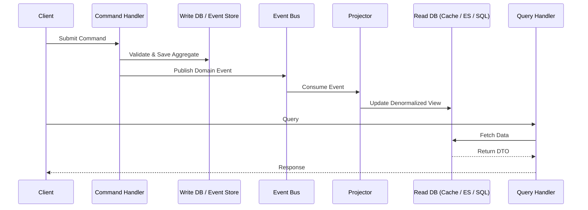

# Command Query Responsibility Segregation (CQRS)

## 概述

命令查询职责分离（CQRS）是一种架构模式，它将 Bertrand Meyer 的 **命令-查询分离（CQS）** 原则从方法级别提升到了服务和系统级别。CQRS 不再使用单一模型处理读取和写入，而是明确地将系统分为两个不同的方面：

- **命令（写端）：** 处理状态变更操作。命令是命令式的意图（例如 `PlaceOrder`、`CancelBooking`）。它们不应返回数据，只应返回成功/失败。
- **查询（读端）：** 处理数据检索。查询是无副作用的请求（例如 `GetOrderSummary`）。它们永远不会改变状态。

> *"CQRS 代表 Command Query Responsibility Segregation。这是我第一次从 Greg Young 那里听说的模式。其核心思想是，你可以使用不同的模型来更新信息和读取信息。"* — **Martin Fowler**

这种分离允许每一边独立优化、扩展和演进，使其成为领域驱动设计（DDD）和事件驱动架构（EDA）的基石。

---

## 为什么使用 CQRS？

传统的 CRUD 架构迫使单一模型服务于双重目的。这会产生一系列经常出现的问题：

| 问题 | 单一模型（CRUD） | CQRS 解决方案 |
|---|---|---|
| **复杂性** | 领域模型被查询特定的逻辑（DTO、投影、缓存）污染。 | 写入模型保持纯粹；读取模型是简单的数据检索。 |
| **性能** | 一个数据库模式必须同时服务于规范化的写入和反规范化的报表。 | 每一边可以使用最好的存储引擎（写入用规范化 RDBMS，读取用 Elasticsearch/Redis）。 |
| **可扩展性** | 读取和写入必须一起扩展。 | 读取和写入模型可以独立扩展（例如，读取用 10 个副本，写入用 1 个主库）。 |
| **安全性** | 读/写权限纠缠在复杂的基于角色的逻辑中。 | 清晰的边界：命令需要写入权限，查询需要读取权限。 |
| **争用** | 写入锁阻塞读取，复杂查询阻塞写入。 | 无争用：写入模型立即提交，读取访问完全独立的存储。 |
| **团队自主权** | 单一模型迫使单个团队拥有整个数据层。 | 不同团队可以拥有命令模型和查询模型。 |

---

## 核心概念

### 命令
- 表示 **意图**。
- 以命令式或过去式命名（`PlaceOrder`、`MarkInvoiceAsPaid`）。
- **不返回数据**（只返回确认或错误）。
- 在 **处理之前** 根据业务规则进行验证。
- 通常入队到命令总线或消息队列。

### 查询
- 表示 **数据请求**。
- 以声明式命名（`GetOrderSummary`、`FindAvailableProducts`）。
- **不应产生副作用**。
- 返回 **DTO** 或只读视图模型。
- 针对高度优化的读取存储执行。

### 命令模型（写端）
- 强制执行业务不变量。
- 通常使用聚合（DDD）来确保一致性。
- 状态变更后发布领域事件。
- 存储：通常是事件存储（事件溯源）或规范化的关系数据库。

### 查询模型（读端）
- 纯粹返回数据。
- 使用反规范化的表、物化视图或专门的搜索索引。
- 通过事件投影 **异步** 更新。
- 可以从事件流完全重建。

### 投影与最终一致性
连接两边的粘合剂是 **事件投影器**（或订阅者）。当命令发布领域事件（例如 `OrderPlacedEvent`）时，事件处理器更新读取模型。



---

## 关键特性

### 1. 分离的模型
写入模型专注于 **一致性和行为**。读取模型专注于 **性能和形状**。它们可以在不同的数据库、不同的模式或不同的编程语言中。

### 2. 基于任务的命令
命令使用领域的 **通用语言** 表达，而不是使用泛指的 CRUD 动词。这改善了领域专家与开发人员之间的沟通。
- **错误：** `UpdateOrderStatus(someBool)`
- **正确：** `ApproveOrder`、`FlagForFraudReview`、`ShipOrder`

### 3. 最终一致性
读取方通常是异步更新的。这意味着读取模型可能稍微落后于写入模型。这是一个有意识的权衡。高事务性系统（银行分类账）可能需要谨慎处理，但大多数系统可以容忍亚秒级的最终一致性。

### 4. 独立扩展
- **写入模型：** 为事务吞吐量垂直扩展，或通过按聚合分片水平扩展。
- **读取模型：** 使用只读副本、缓存层（Redis）或搜索引擎（Elasticsearch）水平扩展。

### 5. 事件溯源兼容性
CQRS 与事件溯源（ES）自然搭配。在这种组合中：
- 命令生成 **事件**。
- 写入存储是 **事件存储**（仅追加日志）。
- 读取模型是从事件流构建的 **投影**。
- 完整的审计追踪和时间查询变得微不足道。

### 6. 增强的可测试性
写入模型可以独立进行单元测试（纯领域逻辑）。读取模型可以针对已知状态进行测试。集成测试验证事件是否正确投影。

---

## 何时使用 / 何时避免

### 使用 CQRS 的场景：
- 你的领域很复杂，并且同一模型对开发造成了显著的拖累。
- **读取工作负载** 与 **写入工作负载** 差异巨大（例如，操作写入 vs. 复杂分析查询）。
- 你需要 **可审计性** 和状态变更的完整 **历史**（与事件溯源结合）。
- 你的系统必须独立扩展读取和写入。
- 你的团队在微服务架构中围绕 **限界上下文** 组织。

### 避免 CQRS 的场景：
- 你的应用程序是简单的 **CRUD**，业务逻辑极少（例如，一个基本的博客或 CMS）。CQRS 会增加意外的复杂性。
- 读取和写入之间必须保持强 **即时一致性**（尽管这可以通过特定模式缓解）。
- 你的团队规模小且不熟悉分布式系统模式。
- 维护两个模型的开销无法通过业务价值证明。

---

## 实现蓝图（附代码示例）

CQRS 是一种架构模式。"安装"它意味着采用一个框架或相应地结构化你的应用层。

### 安装 / 设置

#### .NET（MediatR & Dapper）
```bash
dotnet add package MediatR
dotnet add package Dapper
dotnet add package Microsoft.Data.SqlClient
```

#### Java（Axon Framework）
```xml
<dependency>
    <groupId>org.axonframework</groupId>
    <artifactId>axon-spring-boot-starter</artifactId>
    <version>4.9.3</version>
</dependency>
```

#### Node.js（命令总线 + 物化视图）
```bash
npm install @nestjs/cqrs
```

---

### 示例：电商库存系统

#### 1. 定义命令（写端）

```csharp
// C# / MediatR
public record ReserveInventoryCommand(
    string ProductId,
    int Quantity,
    Guid OrderId
) : IRequest<Result>;
```

#### 2. 定义命令处理器

处理器专一地在 **写入模型**（聚合）上操作。

```csharp
public class ReserveInventoryHandler : IRequestHandler<ReserveInventoryCommand, Result>
{
    private readonly IInventoryRepository _repository;
    private readonly IEventBus _eventBus;

    public ReserveInventoryHandler(IInventoryRepository repository, IEventBus eventBus)
    {
        _repository = repository;
        _eventBus = eventBus;
    }

    public async Task<Result> Handle(ReserveInventoryCommand command, CancellationToken ct)
    {
        // 1. 加载或创建聚合
        var product = await _repository.LoadAsync(command.ProductId);

        // 2. 应用业务逻辑（这会改变状态并引发领域事件）
        var result = product.ReserveInventory(command.Quantity, command.OrderId);
        if (result.IsFailure)
            return result;

        // 3. 持久化聚合（或追加事件）
        await _repository.SaveAsync(product);

        // 4. 发布领域事件（由投影器消费）
        foreach (var domainEvent in product.DomainEvents)
            await _eventBus.Publish(domainEvent, ct);

        return Result.Success();
    }
}
```

#### 3. 定义查询（读端）

查询模型简单、无副作用，并高度针对检索优化。

```csharp
public record GetAvailableStockQuery(string ProductId) : IRequest<int>;

public class GetAvailableStockHandler : IRequestHandler<GetAvailableStockQuery, int>
{
    // 直接依赖读取优化的存储
    private readonly IDbConnection _readDb;

    public GetAvailableStockHandler(IDbConnection readDb) => _readDb = readDb;

    public async Task<int> Handle(GetAvailableStockQuery query, CancellationToken ct)
    {
        // 查询反规范化的物化视图
        const string sql = "SELECT AvailableQuantity FROM InventoryReadModel WHERE ProductId = @ProductId";
        return await _readDb.QuerySingleAsync<int>(sql, new { query.ProductId });
    }
}
```

#### 4. 通过投影同步（事件订阅）

投影器监听领域事件并更新读取模型。

```csharp
public class InventoryReservedProjector : IEventHandler<InventoryReservedEvent>
{
    private readonly IReadModelDbContext _db;

    public InventoryReservedProjector(IReadModelDbContext db) => _db = db;

    public async Task Handle(InventoryReservedEvent @event, CancellationToken ct)
    {
        // 反规范化并更新读取模型
        await _db.ExecuteAsync(
            "UPDATE InventoryReadModel " +
            "SET ReservedQuantity = ReservedQuantity + @Quantity " +
            "WHERE ProductId = @ProductId",
            new { @event.ProductId, @event.Quantity }
        );
    }
}
```

#### 5. 调度（API 控制器）

```csharp
[ApiController]
[Route("api/inventory")]
public class InventoryController : ControllerBase
{
    private readonly IMediator _mediator;

    public InventoryController(IMediator mediator) => _mediator = mediator;

    // 写入
    [HttpPost("reserve")]
    public async Task<ActionResult> Reserve(ReserveInventoryCommand command)
    {
        var result = await _mediator.Send(command);
        return result.IsSuccess ? Accepted() : BadRequest(result.Error);
    }

    // 读取
    [HttpGet("stock")]
    public async Task<ActionResult<int>> GetStock([FromQuery] string productId)
    {
        var stock = await _mediator.Send(new GetAvailableStockQuery(productId));
        return Ok(stock);
    }
}
```

---

## 实践考量

### 一致性模型
- **最终一致性（默认）：** 读取可能是过时的。在 UI 中处理（例如 "订单已提交… 处理中…"）。
- **强一致性：** 对于关键路径，使用写透缓存或同存储读取。CQRS 并不强制所有地方最终一致。

### 命令返回值
命令理想情况下应 **不返回领域数据**，只返回状态（`Accepted`、`BadRequest`、`NotFound`）。如果客户端需要 ID，从命令总线返回，或返回 `Location` 头部。

### 验证
- **输入验证：** 立即验证命令语法（例如，空字段）。
- **业务验证：** 在命令处理器 / 聚合内验证业务规则。

### 版本控制
当读取模型模式变更时，你可以通过从事件存储重放事件来重建它。这是 CQRS + 事件溯源的一个显著的运营优势。

---

## 框架与工具

| 框架 | 语言 | 备注 |
|---|---|---|
| **Axon Framework** | Java / Kotlin | 最成熟的 JVM CQRS/ES 框架。完整的命令总线、事件总线、Saga。 |
| **MediatR** | .NET | 简单的进程内中介者。非常适合在没有消息代理的情况下开始使用 CQRS。 |
| **Eventuate** | Java / Spring | 面向微服务的 CQRS/ES 框架。 |
| **Dapr** | 多语言 | 提供状态存储（用于写入）、发布/订阅 + 输入绑定（用于投影）。非常适合分布式 CQRS。 |
| **Rebus** | .NET | 消息库，天然支持分布式命令/事件管道。 |
| **NServiceBus** | .NET | 企业级消息传递，内置 Saga 支持。 |
| **Ecotone** | PHP | PHP 生态系统的 CQRS/ES 框架。 |
| **CQRS.js / NestJS CQRS** | Node.js | 通过 `@nestjs/cqrs` 在 NestJS 中原生支持。 |

---

## 与其他模式的关系

| 模式 | 关系 |
|---|---|
| **事件溯源** | 将事件作为主要事实源存储。CQRS 中的写入模型通常就是一个事件存储。这种组合提供了完整的可审计性。 |
| **领域驱动设计** | 写入端自然适合 DDD 聚合。命令直接映射到领域事件。 |
| **事件驱动架构** | CQRS 通常在事件代理（Kafka、RabbitMQ、Event Grid）之上实现。投影器是消费者组。 |
| **CQRS vs CQS** | CQS 在方法级别操作。CQRS 在服务/组件级别操作。每个 CQRS 系统隐式是 CQS，但反之不然。 |
| **六边形架构 / 端口与适配器** | CQRS 自然适配：命令/查询是入站端口，持久化数据库是出站适配器。 |

---

## 结论

CQRS 是一种强大的、经过实战检验的架构模式，它为复杂系统带来了清晰性、性能和可扩展性。它并非银弹；它引入了显著的基础设施和一致性复杂性。然而，当在正确的限界上下文中应用时——特别是在高性能、事件驱动或领域复杂的系统中——CQRS 提供了传统 CRUD 模型无法匹敌的架构灵活性。

**从小处着手：** 将一个具有截然不同读写工作负载的限界上下文应用 CQRS。在首次实现中使用简单的中介者库。如果复杂性变得合理，再引入事件溯源和消息代理。

> *"CQRS 是一个简单的模式。困难的部分是理解何时使用它。"* — **Greg Young**