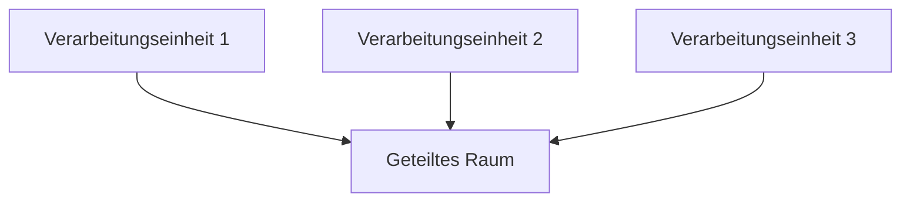

# Raumgebundene Architektur

## Übersicht

Raumgebundene Architektur (SBA) ist ein Architekturmustern, das für eine hohe Skalierbarkeit und eine hohe Verfügbarkeit in verteiltensystemen entworfen ist. Sie organisiert das System um das Konzept von „Räumen“, die als isolierte und autonome Einheiten von Funktionalität gelten. Jeder Raum hat seine eigenen Daten, Logik und Schnittstelle und kommuniziert mit anderen Räumen über Nachrichtenübertragung.

## Hauptmerkmale

1. **Isolierte Räume**: Jeder Raum ist eine selbstständige Einheit mit eigenen Daten, Logik und Schnittstelle.
2. **Nachrichtenübertragung**: Räume kommunizieren miteinander über Nachrichtenübertragung.
3. **Skalierbarkeit**: Die Architektur ist so entworfen, dass sie hohe und unvorhersehbar hohe Lasten verwalten kann.
4. **Hohe Verfügbarkeit**: Durch das Eliminieren von Einzelpunkten von Versagen bleibt das System verfügbar, selbst unter schweren Lasten.
5. ** Ereignisgesteuert**: Räume reagieren auf Ereignisse und aktualisieren den gemeinsamen Zustand.

## Installation

Die Installation der Raumgebundenen Architektur umfasst mehrere komplexe Schritte:

1. **Entwurf und Ingenieurwesen**: Detailierter Entwurf und Ingenieurwesen, um die Strukturanhaftigkeit, Lebensunterstützungssysteme und andere kritische Komponenten zu gewährleisten.
2. **Zusammenbau**: Anbord zusammenbau mit Roboter oder ferngesteuerten Maschinen, oft mit Unterstützung von Astronauten.
3. **Start**: Transport von Komponenten in die Umlaufbahn mit Raketen. Dies ist ein hochspezialisierter und teures Prozess.
4. **Bereitstellung**: Sobald in der Umlaufbahn, werden Komponenten bereitgestellt und verbunden, um das finale Konstrukt zu bilden.

## Grundlegende Nutzung

Die Raumgebundene Architektur kann für eine Vielzahl von Zwecken nach der Bereitstellung verwendet werden:

- **Leben und Arbeiten**: Bereitstellung von Habitat für Astronauten und andere Besatzungsmitglieder.
- **Forschung**: Durchführen von Experimenten und Beobachtungen, die auf der Erde schwer oder unmöglich sind.
- **Wartung und Reparatur**: Durchführen von Routine-Wartungsarbeiten und Reparaturen an Raumstationen und anderen Anlagen.
- **Wirtschaftliche Aktivitäten**: Unterstützung der Tourismus, Herstellung und andere wirtschaftliche Aktivitäten im Raum.

## Beispiel: Ein Raumgebundenes Architektur-System

### Komponenten

1. **Verarbeitungseinheiten**: Diese sind die Kernkomponenten der Raumgebundenen Architektur.
2. **Räume**: Isolierte Einheiten von Funktionalität, die Daten und Logik enthalten.
3. **Geteilte Räume**: Ein zentrales Raumen, in dem alle Verarbeitungseinheiten Nachrichten austauschen können.

### Diagramm



### Schlüsselbefehle

#### Raum Registrierung

```bash
space register --name customer-management --space-type data-management
```

#### Service Aufruf

```bash
space invoke --space customer-management --service create-customer --data '{"name": "John Doe"}'
```

#### Raum Abfrage

```bash
space query --space customer-management --service get-customer --data '{"id": 123}'
```

### Beispiel Szenario

1. **Initialisierung**: Jede Verarbeitungseinheit registriert ihren Raum im geteilten Raum.

```bash
space register --name product-management --space-type data-management
space register --name order-management --space-type data-management
```

2. **Daten Austausch**: Verarbeitungseinheiten tauschen Daten und rufen Services über den geteilten Raum auf.

```bash
space invoke --space product-management --service update-product --data '{"id": 1, "name": "Neues Produkt"}'
space query --space order-management --service get-order --data '{"id": 101}'
```

## Schlussbemerkung

Raumgebundene Architektur repräsentiert eine verändernde Potenzial für die Zukunft der menschlichen Präsenz und Aktivität im Raum. Während sie derzeit durch technologische und wirtschaftliche Beschränkungen eingeschränkt ist, bringt kontinuierliche Forschung und Entwicklung diese Vision näher an die Realität. Mit fortschreitender Raumfahrt und Befestigung wird das Fachgebiet der Raumgebundenen Architektur most likely eine wichtige Rolle bei der Gestaltung unserer Zukunft im Kosmos spielen.