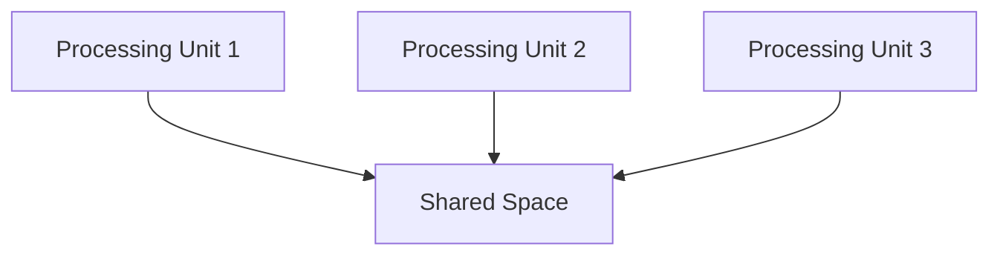

# Space-Based Architecture

## Overview

Space-based architecture (SBA) is an architectural pattern designed for high scalability and high availability in distributed systems. It organizes the system around the concept of "spaces," which are essentially isolated and autonomous units of functionality. Each space has its own data, logic, and interface, and they communicate with each other through message passing.

## Key Features

1. **Isolated Spaces**: Each space is a self-contained unit with its own data, logic, and interface.
2. **Message Passing**: Spaces communicate with each other using message passing.
3. **Scalability**: The architecture is designed to handle high and unpredictable loads.
4. **High Availability**: By eliminating single points of failure, the system remains available even under heavy loads.
5. **Event-Driven**: Spaces respond to events and update shared state.

## Installation

The installation of space-based architecture involves several complex steps:

1. **Design and Engineering**: Detailed design and engineering to ensure structural integrity, life support systems, and other critical components.
2. **Assembly**: On-site assembly using robots or remotely controlled machinery, often with the assistance of astronauts.
3. **Launch**: Transporting components to orbit using rockets. This is a highly specialized and expensive process.
4. **Deployment**: Once in orbit, components are deployed and connected to form the final structure.

## Basic Usage

Space-based architecture can be used for a variety of purposes once operational:

- **Living and Working**: Providing habitats for astronauts and other crew members.
- **Research**: Conducting experiments and observations that are difficult or impossible on Earth.
- **Maintenance and Repair**: Performing routine maintenance and repairs on space stations and other equipment.
- **Commercial Activities**: Supporting tourism, manufacturing, and other commercial activities in space.

## Example: A Space-Based Architecture System

### Components

1. **Processing Units**: These are the core components of the space-based architecture.
2. **Spaces**: Isolated units of functionality that hold data and logic.
3. **Shared Spaces**: A central space where all processing units can exchange messages.

### Diagram



### Key Commands

#### Registering a Space

```bash
space register --name customer-management --space-type data-management
```

#### Invoking a Service

```bash
space invoke --space customer-management --service create-customer --data '{"name": "John Doe"}'
```

#### Querying a Space

```bash
space query --space customer-management --service get-customer --data '{"id": 123}'
```

### Example Scenario

1. **Initialization**: Each processing unit registers its space with the shared space.

```bash
space register --name product-management --space-type data-management
space register --name order-management --space-type data-management
```

2. **Data Exchange**: Processing units exchange data and invoke services through the shared space.

```bash
space invoke --space product-management --service update-product --data '{"id": 1, "name": "New Product"}'
space query --space order-management --service get-order --data '{"id": 101}'
```

## Conclusion

Space-based architecture represents a transformative potential for the future of human presence and activity in space. While currently limited by technological and economic constraints, ongoing research and development are bringing this vision closer to reality. As space exploration and habitation continue to advance, the field of space-based architecture will likely play a crucial role in shaping our future in the cosmos.