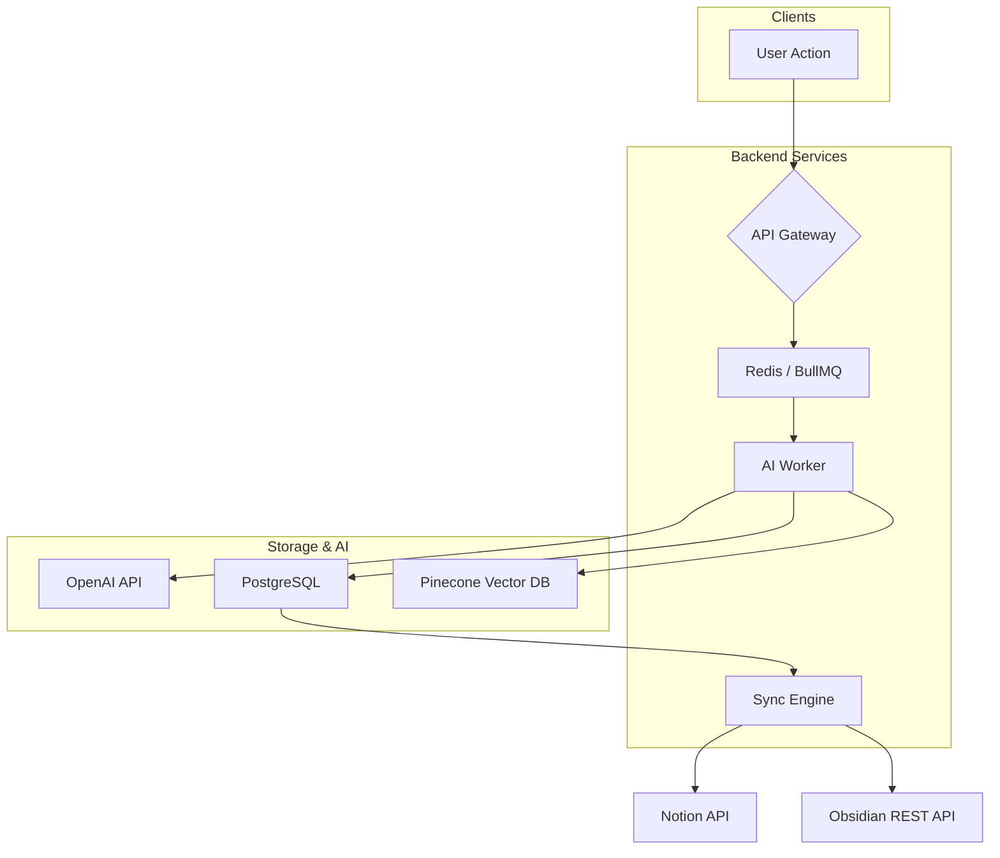

# Briefmind AI Notes

*Developer Wiki*

**Briefmind** transforms how users capture, retain, and organize information. This wiki provides the technical deep-dive for the runnable monorepo, covering architecture decisions, local development setup, and key code examples.

## Table of Contents

- [1. Project Structure](#1-project-structure)
- [2. System Architecture](#2-system-architecture)
- [3. Setup & Development](#3-setup--development)
- [4. Key Code Examples](#4-key-code-examples)
- [5. Configuration](#5-configuration)
- [6. Testing](#6-testing)
- [7. Deployment](#7-deployment)
- [8. API Endpoints Summary](#8-api-endpoints-summary)
- [9. Troubleshooting](#9-troubleshooting)

---

## 1. Project Structure

The codebase is a **Turborepo monorepo** unifying the frontend clients, shared packages, and backend AI / sync services.

```
briefmind/
├── apps/
│   ├── web/                  # Next.js 14 (App Router) — Primary web UI
│   ├── extension/            # Chrome Manifest V3 extension — Universal highlighter
│   └── mobile/               # React Native (Expo) — iOS / Android
├── packages/
│   ├── core/                 # Shared types, Zod validators, constants
│   ├── ui/                   # Shared React component library (Tailwind + Radix)
│   ├── config/               # ESLint, TSConfig, Tailwind presets
│   └── db/                   # Prisma schema, migrations, seed scripts
├── services/
│   ├── api/                  # Node.js (Express / Fastify) — API gateway
│   ├── ai-worker/            # Python (FastAPI) — LLM inference worker
│   └── sync-engine/          # Background worker — Notion / Obsidian sync
├── docker-compose.yml        # Postgres, Redis, Qdrant, MinIO
├── turbo.json
└── package.json
```

---

## 2. System Architecture

### High-Level Data Flow

1. **Client Action** (Web, Extension, Mobile): User highlights text or clicks “Summarize” / “Generate Flashcards.”
2. **API Gateway** (`services/api`): Authenticates the request (Clerk JWT), enqueues a job into Redis via BullMQ.
3. **AI Worker** (`services/ai-worker`): Polls the queue, calls OpenAI (GPT-4o-mini / GPT-4o) with function calling or structured outputs, stores results in PostgreSQL and indexes the vector embedding in Pinecone.
4. **Sync Engine** (`services/sync-engine`): Watches the `notes` table (CDC via Postgres LISTEN/NOTIFY or polling), pushes updates to connected third-party tools via their official APIs.



### Key Technology Decisions

| Component | Choice | Rationale |
|---|---|---|
| AI Worker Language | Python (FastAPI) | Native bindings for PyTorch, OpenAI SDK, NVIDIA NIM. |
| Queue | Redis (BullMQ / RQ) | Persistent, low-latency, excellent Node/Python clients. |
| Database | PostgreSQL (via Supabase) | Real-time subscriptions, robust relational features, pgvector for basic similarity. |
| Vector Store | Pinecone | Fully managed, high recall, multi-tenancy out of the box. |
| Flashcard Scheduler | FSRS (Free Spaced Repetition Scheduler) | Modern algorithm, supersedes Anki SM-2. |
| Auth | Clerk | Multi-session, SSO, webhooks for user lifecycle. |

---

## 3. Setup & Development

### Prerequisites

- **Node.js** 20+
- **pnpm** 8+
- **Python** 3.11+
- **Docker** (Postgres, Redis, MinIO, Qdrant)
- An **OpenAI API Key**

### Clone & Install

```bash
git clone https://github.com/briefmind/notes.git
cd briefmind
pnpm install

# Python worker dependencies (we recommend a dedicated virtual environment)
cd services/ai-worker
python3 -m venv .venv && source .venv/bin/activate
pip install -r requirements.txt
```

### Environment Variables

Copy `.env.example` in each app/service directory to `.env.local`. Key variables:

| Variable | Description | Example |
|---|---|---|
| `OPENAI_API_KEY` | LLM provider key | `sk-proj-...` |
| `SUPABASE_URL` | Postgres / Auth URL | `http://localhost:54321` |
| `SUPABASE_SERVICE_ROLE_KEY` | Admin-level DB access | … |
| `NEXT_PUBLIC_CLERK_PUBLISHABLE_KEY` | Clerk front-end key | … |
| `CLERK_SECRET_KEY` | Clerk back-end secret | … |
| `REDIS_URL` | Queue connection string | `redis://localhost:6379` |
| `PINECONE_API_KEY` | Vector DB access | … |

### Start Local Dependencies

```bash
docker compose up -d

# Run database migrations
pnpm --filter @briefmind/db run migrate:dev

# Seed the database with sample users / notes
pnpm --filter @briefmind/db run seed
```

### Run the Development Servers

```bash
# Run all packages & apps concurrently
pnpm dev

# --- or individually ---
pnpm --filter @briefmind/web dev       # http://localhost:3000
pnpm --filter @briefmind/api dev        # http://localhost:4000
pnpm --filter @briefmind/ai-worker dev  # http://localhost:8000 (FastAPI)
pnpm --filter @briefmind/sync-engine dev
```

### Run the Browser Extension

```bash
cd apps/extension
pnpm dev
# Load the unpacked directory `apps/extension/dist` in Chrome → chrome://extensions
```

---

## 4. Key Code Examples

### 4.1. AI Summarization Invocation (`services/ai-worker/main.py`)

Uses OpenAI function calling (or Structured Outputs) to enforce a consistent JSON shape.

```python
import json
import openai
from pydantic import BaseModel, Field


class SummaryOutput(BaseModel):
    title: str
    key_points: list[str] = Field(..., min_length=3, max_length=10)
    summary: str


async def generate_summary(content: str, source_type: str) -> dict:
    """Generate a structured summary for a given article / video transcript."""

    system_prompt = (
        f"You are a concise note-taking assistant. "
        f"Summarize this {source_type} and extract the most important insights."
    )

    response = await openai.chat.completions.create(
        model="gpt-4o-mini",
        messages=[
            {"role": "system", "content": system_prompt},
            {"role": "user", "content": content},
        ],
        functions=[{
            "name": "save_summary",
            "parameters": SummaryOutput.model_json_schema(),
        }],
        function_call={"name": "save_summary"},
    )

    arguments = response.choices[0].message.function_call.arguments
    return json.loads(arguments)
```

### 4.2. Browser Extension – Universal Highlighter (`apps/extension/src/content_script.ts`)

Injects a floating toolbar on text selection to allow one-click note creation or flashcard generation.

```typescript
import { injectFloatingToolbar } from './toolbar';

document.addEventListener('mouseup', async (event: MouseEvent) => {
    const selection = window.getSelection();
    if (!selection || selection.isCollapsed) return;

    const text = selection.toString().trim();
    if (text.length < 30) return; // Ignore tiny selections

    const range = selection.getRangeAt(0);
    const rect = range.getBoundingClientRect();

    injectFloatingToolbar(
        { x: event.clientX, y: event.clientY },
        async (action: 'summarize' | 'flashcard') => {
            const response = await chrome.runtime.sendMessage({
                type: 'CREATE_NOTE',
                payload: {
                    action,
                    text,
                    url: window.location.href,
                    title: document.title,
                },
            });
            showNotification(`✨ ${action} note created!`);
        }
    );
});
```

### 4.3. Flashcard Generation & FSRS Scheduling (`packages/core/src/spaced-repetition.ts`)

Briefmind uses the **FSRS** algorithm for optimal memory retention.

```typescript
import { fsrs, generatorParameters, Rating, type Card as FSRSCard } from 'fsrs-ts';

const params = generatorParameters({ enable_fuzz: true, maximum_interval: 36500 });
const scheduler = fsrs(params);

export function scheduleReview(currentCard: BriefmindCard, rating: Rating): BriefmindCard {
    const schedulingCards = scheduler.repeat(currentCard as unknown as FSRSCard, new Date());
    const updated = schedulingCards[rating].card;

    return {
        ...currentCard,
        due: updated.due,
        stability: updated.stability,
        difficulty: updated.difficulty,
        elapsed_days: updated.elapsed_days,
        scheduled_days: updated.scheduled_days,
        reps: currentCard.reps + 1,
        lapses: rating === Rating.Again ? currentCard.lapses + 1 : currentCard.lapses,
        state: updated.state,
    };
}
```

### 4.4. Notion Sync Adapter (`services/sync-engine/src/adapters/notion.ts`)

Bi-directional sync with Notion databases using the official SDK.

```typescript
import { Client } from '@notionhq/client';

export class NotionSyncAdapter implements SyncAdapter {
    private notion: Client;

    constructor(accessToken: string) {
        this.notion = new Client({ auth: accessToken });
    }

    async createNote(note: Note): Promise<void> {
        await this.notion.pages.create({
            parent: { database_id: note.parentDatabaseId },
            properties: {
                'Title': { title: [{ text: { content: note.title } }] },
                'Source URL': { url: note.sourceUrl },
                'AI Summary': { rich_text: [{ text: { content: note.aiSummary } }] },
            },
        });
    }
}
```

---

## 5. Configuration

Feature flags and global settings are managed centrally in `packages/config`.

```typescript
// packages/config/features.ts
export const features = {
    aiImageAnalysis: process.env.NEXT_PUBLIC_FF_AI_VISION === 'true',
    offlineMode: true,
    realtimeCollaboration: false, // Beta flag
    richTextEditor: true,
};
```

**Monorepo task orchestration** (`turbo.json`):

```json
{
  "$schema": "https://turbo.build/schema.json",
  "pipeline": {
    "build": {
      "dependsOn": ["^build"],
      "outputs": [".next/**", "dist/**"]
    },
    "dev": {
      "cache": false,
      "persistent": true
    }
  }
}
```

---

## 6. Testing

```bash
# Unit & integration (Vitest / Jest)
pnpm run test

# AI output evaluation (Python)
cd services/ai-worker
pip install pytest pytest-asyncio bert-score evaluate

# Run eval on a curated dataset of 100 articles
python -m pytest tests/eval/ --eval-dataset tests/fixtures/benchmark.jsonl

# End-to-end (Playwright)
cd apps/web
pnpm exec playwright test --config e2e/playwright.config.ts
```

---

## 7. Deployment

| Service | Platform | Build Command / Notes |
|---|---|---|
| **Web** | Vercel | `pnpm run build` (monorepo aware) |
| **Mobile** | Expo Application Services (EAS) | `eas build --platform all` |
| **Extension** | Chrome Web Store | GitHub Action → `chrome-webstore-upload` |
| **API Gateway** | Railway / Fly.io | Dockerfile (Node.js) |
| **AI Worker** | Modal / RunPod | Python container (CUDA for local models if enabled) |
| **Sync Engine** | Railway | Node.js worker (long-lived process) |

---

## 8. API Endpoints Summary

| Method | Endpoint | Description | Auth |
|---|---|---|---|
| `POST` | `/api/notes/summarize` | Generate AI summary for a URL or raw text | Bearer Token |
| `POST` | `/api/flashcards/generate` | Create flashcards from a note ID | Bearer Token |
| `PUT` | `/api/notes/:id` | Update note content / folder | Bearer Token |
| `POST` | `/api/sync/notion/connect` | Exchange OAuth token for Notion access | Bearer Token |
| `GET` | `/api/collections` | List user’s collections / folders | Bearer Token |

---

## 9. Troubleshooting

### “AI Summary fails to generate”
- Check the **AI Worker** logs. The most common cause is exceeding the model’s context window.
- Adjust `MAX_TOKENS` in `services/ai-worker/.env`.
- Verify the `OPENAI_API_KEY` has sufficient quota.

### “Extension not injecting”
- Ensure `host_permissions` in `manifest.json` includes `<all_urls>` or `*://*/*`.
- Open the extension’s background page console to check for CSP violations.
- Reload the extension after any change.

### “Sync to Obsidian fails”
- The sync engine communicates with Obsidian’s **Local REST API**.
- Confirm the “Allow REST API” toggle is enabled in Obsidian Settings → Community Plugin → Local REST API.
- Verify the API key in the user’s integration settings matches the one configured in Obsidian.

### “Database migrations fail”
- Ensure Docker services are running (`docker compose up -d`).
- Run `pnpm --filter @briefmind/db run generate` to re-generate the Prisma client if the schema changed.
- Drop and recreate the local database: `pnpm --filter @briefmind/db run migrate:reset`.